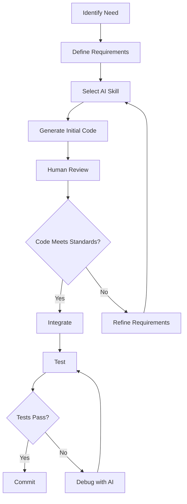

# AI Development Framework - Comprehensive Summary

## 🎯 Executive Summary

This document provides a **comprehensive summary** of the AI Development Framework created for the Trading Platform project. It consolidates all the AI integration strategies, guidelines, and implementation plans into a single reference document.

## 📊 Project Analysis

### Current State Assessment

The Trading Platform project is a **well-architected HFT Learning Platform** with:

✅ **Clear Architecture**: Modular design with well-defined components (Feed Handlers, Algorithms, Execution, Risk, Market Data)
✅ **Comprehensive Documentation**: ARCHITECTURE.md, IMPLEMENTATION.md, DEVELOPMENT.md
✅ **Phased Implementation Plan**: Realistic 7-phase roadmap with clear milestones
✅ **Authentic HFT Technologies**: Aeron, SBE, UDP multicast, Prometheus, Grafana, QuestDB
✅ **Learning Focus**: Designed to teach HFT technologies through hands-on implementation

### AI Opportunity Analysis

| Area | Opportunity | Potential Impact | Priority |
|------|-------------|------------------|----------|
| **Code Generation** | Boilerplate, SBE classes, base implementations | 70% time reduction | ⭐⭐⭐⭐⭐ |
| **Testing** | Unit, integration, performance tests | 80% coverage with 50% less effort | ⭐⭐⭐⭐⭐ |
| **Infrastructure** | Docker, Kubernetes, CI/CD | 60% faster setup | ⭐⭐⭐⭐ |
| **Documentation** | API docs, guides, ADRs | 100% coverage | ⭐⭐⭐ |
| **Code Review** | Quality checks, best practices | 80% bug detection | ⭐⭐⭐⭐⭐ |
| **Performance** | Optimization, profiling | 30% improvement | ⭐⭐⭐⭐ |
| **Debugging** | Log analysis, root cause | 50% faster resolution | ⭐⭐⭐⭐ |

---

## 🏗️ AI Framework Architecture

### Core Components

```
┌─────────────────────────────────────────────────────────────────────────────┐
│                    AI DEVELOPMENT FRAMEWORK                                    │
├─────────────────────────────────────────────────────────────────────────────┤
│                                                                              │
│  ┌─────────────────┐    ┌─────────────────┐    ┌─────────────────┐      │
│  │  AI Skills        │    │  AI Workflows    │    │  AI Quality       │      │
│  │  (Domain Expertise)│   │  (Processes)      │    │  (Assurance)      │      │
│  └────────┬────────┘    └────────┬────────┘    └────────┬────────┘      │
│            │                   │                   │                 │
│            ▼                   ▼                   ▼                 │
│  ┌─────────────────────────────────────────────────────────────────────┐   │
│  │                        AI Development Framework                          │   │
│  │  - HFT Domain Skills (Aeron, SBE, Market Data, Strategies, etc.)      │   │
│  │  - Testing Skills (Unit, Integration, Performance, Load)               │   │
│  │  - DevOps Skills (Docker, Kubernetes, CI/CD, Monitoring)               │   │
│  │  - Documentation Skills (API, Architecture, Development Guides)        │   │
│  └─────────────────────────────────────────────────────────────────────┘   │
│                                                                              │
│  ┌─────────────────────────────────────────────────────────────────────┐   │
│  │                        Implementation Roadmap                            │   │
│  │  Phase 1: Core Pipeline (Weeks 1-2) - AI Foundation                     │   │
│  │  Phase 2: Strategies (Weeks 3-4) - AI-Assisted Strategy Framework        │   │
│  │  Phase 3: Scale & Optimize (Weeks 5-6) - AI-Driven Performance           │   │
│  │  Phase 4: AWS Deployment (Week 7) - AI-Assisted DevOps                   │   │
│  └─────────────────────────────────────────────────────────────────────┘   │
└─────────────────────────────────────────────────────────────────────────────┘
```

### AI Skills Taxonomy

#### 🎯 **HFT Domain Skills** (7 Categories, 14+ Skills)

1. **Aeron Configuration**
   - `hft-aeron-setup`: Media driver configuration and UDP multicast setup
   - `hft-aeron-optimize`: Performance tuning and optimization

2. **SBE Schema**
   - `hft-sbe-design`: Schema design and C# class generation
   - `hft-sbe-validate`: Schema validation and compatibility checking

3. **Market Data**
   - `hft-market-data`: Feed handlers, synthetic data, processors
   - `hft-market-data-normalize`: Data normalization across exchanges

4. **Strategy Framework**
   - `hft-strategy-framework`: Strategy interfaces, base classes, managers
   - `hft-strategy-optimize`: Strategy optimization and backtesting

5. **Execution**
   - `hft-execution`: Execution simulator, exchange connectors, order management
   - `hft-execution-validate`: Execution logic validation

6. **Risk Management**
   - `hft-risk-management`: Risk service, checks, monitoring
   - `hft-risk-validate`: Risk configuration validation

7. **Performance**
   - `hft-performance`: Optimization suggestions and analysis
   - `hft-performance-benchmark`: Performance benchmarking

#### 🧪 **Testing Skills**

- `test-unit-generation`: Comprehensive unit test generation
- `test-integration`: Integration test design and generation
- `test-performance`: Performance test creation
- `test-latency`: Latency measurement tests
- `test-regression`: Regression test generation

#### ⚙️ **DevOps Skills**

- `devops-docker`: Docker configuration generation
- `devops-kubernetes`: Kubernetes deployment manifests
- `devops-monitoring`: Prometheus, Grafana, alerting configuration
- `devops-ci-cd`: CI/CD pipeline generation
- `devops-infrastructure`: Infrastructure as code (Terraform, etc.)

#### 📝 **Documentation Skills**

- `docs-architecture`: Architecture documentation and diagrams
- `docs-api`: API documentation generation
- `docs-development`: Development guides and tutorials
- `docs-deployment`: Deployment guides and troubleshooting

---

## 🗺️ AI-Enhanced Implementation Roadmap

### Phase 1: Core Pipeline (Weeks 1-2) - AI Foundation

**Objective**: Establish AI development framework and implement core messaging pipeline

**AI Tasks**:
```bash
# AI-assisted project analysis
ai-analyze --project trading-platform

# AI-generated SBE schema
ai-develop --skill hft-sbe-design --schema-type market-data

# AI-generated Aeron wrapper
ai-develop --skill hft-aeron-setup --component AeronPublisher

# AI-generated synthetic feed
ai-develop --skill hft-market-data --component SyntheticFeed

# AI-generated tests
ai-test --generate --component AeronPublisher --type unit
ai-test --generate --flow "SyntheticFeed->Aeron->Subscriber" --type integration

# AI-suggested optimizations
ai-optimize --component AeronPublisher --metric latency
```

**Deliverables**:
- ✅ SBE schema with market data message types
- ✅ C# SBE generated classes
- ✅ Aeron wrapper library (Publisher, Subscriber, Config)
- ✅ Synthetic feed generator with configurable parameters
- ✅ Unit tests for all core components (90%+ coverage)
- ✅ Integration tests for message flow
- ✅ Performance baseline measurements
- ✅ AI optimization suggestions

### Phase 2: Add Strategies (Weeks 3-4) - AI-Assisted Strategy Framework

**Objective**: Implement trading strategy framework with AI assistance

**AI Tasks**:
```bash
# AI-designed strategy interface
ai-develop --skill hft-strategy-framework --task "Create ITradingAlgorithm interface"

# AI-generated strategy implementations
ai-develop --skill hft-strategy-framework --strategy market-making
ai-develop --skill hft-strategy-framework --strategy statistical-arbitrage

# AI-generated execution simulator
ai-develop --skill hft-execution --component ExecutionSimulator

# AI-generated QuestDB writer
ai-develop --skill hft-market-data --component QuestDbWriter

# AI-generated comprehensive tests
ai-test --generate --component MarketMakingStrategy --type unit
ai-test --generate --flow "Feed->Strategy->Execution->Storage" --type integration
```

**Deliverables**:
- ✅ Strategy interface and base classes
- ✅ Strategy manager for multi-strategy coordination
- ✅ Market Making strategy implementation
- ✅ Statistical Arbitrage strategy implementation
- ✅ Execution simulator with realistic behavior
- ✅ QuestDB writer for market data storage
- ✅ Comprehensive unit tests for all new components
- ✅ End-to-end integration tests

### Phase 3: Scale & Optimize (Weeks 5-6) - AI-Driven Performance

**Objective**: Scale the system and optimize performance with AI assistance

**AI Tasks**:
```bash
# AI-assisted scaling analysis
ai-optimize --analyze --system trading-platform --current "1k msgs/sec" --target "20k msgs/sec"

# AI-generated multi-channel Aeron configuration
ai-develop --skill hft-aeron-setup --task "Configure multiple channels"

# AI-enhanced synthetic feed with multiple instruments
ai-develop --skill hft-market-data --component SyntheticFeed --enhancement "multiple_instruments"

# AI-generated performance benchmarks
ai-test --generate --type performance --component AeronPublisher --scenarios "1k,5k,10k,20k"

# AI-suggested Aeron configuration tuning
ai-optimize --skill hft-aeron-optimize --target-throughput 20000

# AI-assisted memory optimization
ai-optimize --analyze --component StrategyManager --metric memory
```

**Deliverables**:
- ✅ Multi-channel Aeron configuration
- ✅ Enhanced synthetic feed with 100+ instruments
- ✅ Strategy pooling for reduced GC pressure
- ✅ Performance benchmarks for all critical components
- ✅ Aeron configuration tuning recommendations
- ✅ Memory optimization suggestions and implementations
- ✅ Load testing scenarios and results

### Phase 4: AWS Deployment Testing (Week 7) - AI-Assisted DevOps

**Objective**: Test deployment on AWS with AI assistance

**AI Tasks**:
```bash
# AI-generated Docker configurations
ai-devops --generate --type docker --all-services

# AI-generated Docker Compose for AWS testing
ai-devops --generate --type docker-compose --environment aws

# AI-generated Kubernetes manifests
ai-devops --generate --type kubernetes --all-services --helm-chart

# AI-generated CI/CD pipeline
ai-devops --generate --type ci-cd --platform github-actions

# AI-configured monitoring and alerting
ai-devops --generate --type monitoring --include prometheus,grafana
```

**Deliverables**:
- ✅ Docker configurations for all services
- ✅ Docker Compose for local and AWS testing
- ✅ Kubernetes manifests for future scaling
- ✅ CI/CD pipeline with GitHub Actions
- ✅ Monitoring configuration with Prometheus and Grafana
- ✅ Alert rules for critical conditions
- ✅ Cost optimization recommendations

---

## 🎯 AI Integration by Component

### 1. Common Library

| Component | AI Skills | AI Assistance | Human Review Points |
|-----------|-----------|---------------|---------------------|
| SBE Generated Classes | `hft-sbe-design` | Schema design, C# class generation | Schema validation, naming conventions |
| Aeron Wrapper | `hft-aeron-setup` | Publisher, subscriber, configuration | Error handling, performance parameters |
| Metrics | `hft-monitoring` | Prometheus metrics, histograms | Metric relevance, performance impact |
| Logging | `hft-logging` | Structured logging, correlation IDs | Log level appropriateness |

### 2. Feed Handlers

| Component | AI Skills | AI Assistance | Human Review Points |
|-----------|-----------|---------------|---------------------|
| Feed Handler Base | `hft-market-data` | Abstract base class, error handling | Interface design, extensibility |
| Synthetic Feed | `hft-market-data` | Configurable generator, realistic patterns | Data realism, performance |
| Crypto Feed Handlers | `hft-market-data` | Exchange API integration, normalization | API compliance, error handling |
| Market Data Recorder | `hft-market-data` | QuestDB writer, batch optimization | Storage requirements, sampling |

### 3. Trading Algorithms

| Component | AI Skills | AI Assistance | Human Review Points |
|-----------|-----------|---------------|---------------------|
| Strategy Interface | `hft-strategy-framework` | Clear contract, extensibility | Design patterns, completeness |
| Strategy Base Class | `hft-strategy-framework` | Common functionality, lifecycle | Thread safety, resource management |
| Strategy Manager | `hft-strategy-framework` | Multi-strategy coordination | Concurrency, monitoring |
| Market Making | `hft-strategy-framework` | Configurable parameters, realistic behavior | Trading logic correctness |
| Statistical Arbitrage | `hft-strategy-framework` | Mathematical models, pairs trading | Algorithm correctness, risk parameters |

### 4. Execution Services

| Component | AI Skills | AI Assistance | Human Review Points |
|-----------|-----------|---------------|---------------------|
| Execution Simulator | `hft-execution` | Fill probability, latency simulation | Realism, error handling |
| Exchange Connectors | `hft-execution` | API integration, rate limiting | API compliance, error handling |
| Order Manager | `hft-execution` | State tracking, reconciliation | Order lifecycle correctness |
| Order Router | `hft-execution` | Routing logic, fee optimization | Routing strategy validation |

### 5. Risk Service

| Component | AI Skills | AI Assistance | Human Review Points |
|-----------|-----------|---------------|---------------------|
| Risk Checks | `hft-risk-management` | Position, exposure, loss limits | Risk logic correctness, thresholds |
| Risk Monitor | `hft-risk-management` | Real-time monitoring, NATS integration | Monitoring coverage, alerting |
| Risk Actions | `hft-risk-management` | Order cancellation, algorithm disabling | Action safety, side effects |

### 6. Market Data Services

| Component | AI Skills | AI Assistance | Human Review Points |
|-----------|-----------|---------------|---------------------|
| Market Data Cache | `hft-market-data` | Order book management, ticker aggregation | Data structure efficiency |
| QuestDB Writer | `hft-market-data` | Batch writing, error handling | Performance, reliability |
| Data Backfill | `hft-market-data` | Historical data loading, caching | Query efficiency, data integrity |

---

## 🧪 AI Testing Strategy

### Testing Pyramid with AI

```
                    ┌─────────────────┐
                    │   E2E Tests      │  ← AI-assisted scenario generation (10-20 tests)
                    └────────┬────────┘
                             │
                    ┌────────▼────────┐
                    │ Integration Tests │  ← AI-generated service interaction tests (50-100 tests)
                    └────────┬────────┘
                             │
                    ┌────────▼────────┐
                    │   Unit Tests     │  ← AI-generated comprehensive unit tests (200-500 tests)
                    └─────────────────┘
```

### Test Generation Approach

#### 1. Unit Test Generation

**AI Prompt Template:**
```
Generate comprehensive unit tests for the following C# class:
[PASTE CLASS CODE]

Requirements:
- Use xUnit framework
- Follow Arrange-Act-Assert pattern
- Test all public methods and properties
- Include edge cases: null inputs, empty collections, boundary values
- Mock all external dependencies using Moq
- Target 95%+ code coverage
- Include performance-critical path tests
- Add XML documentation comments
```

**Quality Checklist:**
- [ ] Tests compile without errors
- [ ] Tests run and pass
- [ ] Tests increase code coverage
- [ ] Tests are relevant to the component
- [ ] Tests execute quickly (<100ms each)
- [ ] Tests are deterministic and reliable

#### 2. Integration Test Generation

**AI Prompt Template:**
```
Create integration tests for the market data pipeline that tests:
1. SyntheticFeed -> Aeron -> MarketDataProcessor flow
2. SBE message serialization/deserialization
3. Error handling and recovery scenarios
4. Performance under load (1k, 5k, 10k msgs/sec)

Requirements:
- Use Docker Compose for test dependencies
- Include test containers for Aeron, Prometheus
- Measure end-to-end latency
- Verify message integrity
- Test error injection and recovery
```

#### 3. Performance Test Generation

**AI Prompt Template:**
```
Generate performance benchmarks for Aeron message publishing:
- Measure publish latency for different message sizes
- Test throughput at 1k, 5k, 10k, 20k messages/sec
- Include memory allocation measurements
- Compare different buffer configurations
- Use BenchmarkDotNet framework

Target: <50μs publish latency, <1% GC time
```

### Test Quality Metrics

| Metric | Target | Measurement |
|--------|--------|-------------|
| Unit Test Coverage | 90%+ | Code coverage tools |
| Integration Test Coverage | 80%+ | Service interaction coverage |
| Test Execution Time | <5 minutes | CI pipeline timing |
| Test Reliability | 99%+ | Test pass rate |
| Test Generation Speed | <1 hour | Time to generate tests for a component |
| Bug Detection Rate | 80%+ | Bugs caught by tests |

---

## 📚 AI Development Guidelines

### When to Use AI

#### ✅ **DO Use AI for:**

| Category | Examples | Benefits |
|----------|----------|----------|
| **Boilerplate Code** | DTOs, models, interfaces, configuration classes | Saves time, reduces errors |
| **Test Generation** | Unit tests, integration tests, test data | Increases coverage, finds edge cases |
| **Documentation** | API docs, code comments, development guides | Improves documentation quality |
| **Infrastructure** | Docker files, Kubernetes manifests, CI/CD pipelines | Accelerates DevOps tasks |
| **Code Refactoring** | Improving code structure, applying design patterns | Enhances code quality |
| **Performance Analysis** | Profiling, bottleneck identification, optimization suggestions | Improves system performance |
| **Debugging Assistance** | Log analysis, error diagnosis, root cause identification | Speeds up troubleshooting |
| **Code Review** | Quality checks, best practice validation, security scanning | Improves code review efficiency |

#### ❌ **DON'T Use AI for:**

| Category | Examples | Risks |
|----------|----------|-------|
| **Critical Trading Logic** | Order execution, risk calculations, pricing algorithms | Financial risk, incorrect behavior |
| **Security-Sensitive Code** | Authentication, encryption, API keys, secrets management | Security vulnerabilities, data breaches |
| **Financial Calculations** | P&L calculations, risk metrics, valuation models | Financial inaccuracies, compliance issues |
| **Production Deployment** | Deployment scripts, infrastructure changes | System downtime, data loss |
| **Complex Architecture** | System design, component boundaries, integration patterns | Poor design decisions, technical debt |
| **Legal/Compliance Code** | Regulatory reporting, audit trails, compliance checks | Legal violations, audit failures |

### Code Generation Process



### Code Quality Checklist for AI-Generated Code

**General Quality:**
- [ ] Follows project coding standards
- [ ] Proper naming conventions
- [ ] Consistent formatting
- [ ] Appropriate comments and documentation
- [ ] Proper error handling
- [ ] Appropriate logging

**Performance:**
- [ ] Minimizes allocations in hot paths
- [ ] Uses appropriate data structures
- [ ] Avoids boxing/unboxing
- [ ] Proper async/await usage
- [ ] Thread-safe where required
- [ ] No unnecessary object creation

**Security:**
- [ ] No hardcoded secrets or credentials
- [ ] Proper input validation
- [ ] Secure configuration handling
- [ ] Appropriate access controls
- [ ] No SQL injection vulnerabilities
- [ ] Proper exception handling (no sensitive data in exceptions)

**Testability:**
- [ ] Testable design (dependency injection)
- [ ] Mockable dependencies
- [ ] Clear separation of concerns
- [ ] Proper interfaces for testing
- [ ] No static methods that hinder testing

---

## 📊 Success Metrics and KPIs

### AI Effectiveness Metrics

| Metric | Target | Measurement Method | Frequency |
|--------|--------|---------------------|-----------|
| **Code Generation Speed** | 10x faster | Time to implement feature with vs without AI | Per feature |
| **Test Coverage** | 90%+ | Automated test coverage measurement | Per commit |
| **Bug Detection Rate** | 80%+ | Bugs caught by AI-generated tests before human review | Per release |
| **Optimization Success** | 30%+ | Performance improvements from AI suggestions | Per optimization |
| **Documentation Completeness** | 100% | Percentage of components with AI-generated docs | Per milestone |
| **Code Review Efficiency** | 50%+ | Time saved in code reviews using AI assistance | Per PR |

### Development Metrics

| Metric | Target | Measurement Method | Frequency |
|--------|--------|---------------------|-----------|
| **Feature Implementation Time** | <2 days | Time from request to merge | Per feature |
| **Bug Fix Time** | <1 hour | Time from report to fix | Per bug |
| **Test Suite Runtime** | <5 minutes | Total test execution time | Per commit |
| **Build Success Rate** | 99%+ | Percentage of successful builds | Per day |
| **Deployment Frequency** | Daily | Number of deployments to test environment | Per day |
| **Production Deployment Frequency** | Weekly | Number of deployments to production | Per week |

### Performance Metrics

| Metric | Target | Measurement Method | Frequency |
|--------|--------|---------------------|-----------|
| **Aeron Publish Latency** | <50μs | Prometheus histogram | Continuous |
| **Aeron Receive Latency** | <50μs | Prometheus histogram | Continuous |
| **Strategy Processing Latency** | <100μs | Prometheus histogram | Continuous |
| **Tick-to-Trade Latency** | <1ms | End-to-end measurement | Continuous |
| **Throughput** | 20k msgs/sec | Prometheus counter | Continuous |
| **Message Loss Rate** | <0.001% | Aeron counters | Continuous |
| **GC Time** | <1% | .NET counters | Continuous |

---

## 🚀 Getting Started

### Immediate Actions (Week 1)

1. **Set Up AI Development Environment**
   ```bash
   # Install AI development tools
   dotnet tool install --global ai-development-cli
   npm install -g @trading-platform/ai-skills
   
   # Initialize AI framework
   ai-init --project trading-platform --language csharp --framework dotnet8
   
   # Configure AI skills
   ai-skill add hft-aeron-setup
   ai-skill add hft-sbe-design
   ai-skill add hft-market-data
   ai-skill add hft-strategy-framework
   ai-skill add hft-execution
   ai-skill add hft-performance
   ```

2. **Read Framework Documentation**
   - [AI Development Framework](ai_development_framework.md)
   - [Extended Implementation Plan](extended_implementation_plan.md)
   - [HFT Skills](skills/hft_skills.md)

3. **Start with Small AI Tasks**
   ```bash
   # Generate unit tests for existing code
   ai-test --generate --component MarketDataProcessor --type unit
   
   # Generate SBE schema
   ai-develop --skill hft-sbe-design --schema-type market-data
   
   # Create Aeron wrapper
   ai-develop --skill hft-aeron-setup --component AeronPublisher
   ```

### Short-term Goals (Weeks 2-4)

1. **Implement Phase 1 with AI**
   - Core messaging pipeline
   - Synthetic feed
   - Aeron wrapper
   - Comprehensive tests

2. **Establish AI Workflows**
   - Code generation workflow
   - Test generation workflow
   - Code review workflow

3. **Measure AI Effectiveness**
   - Track development metrics
   - Monitor code quality
   - Assess performance improvements

### Long-term Goals (Weeks 5-8+)

1. **Complete All Phases with AI**
   - Strategy framework
   - Execution services
   - Scaling and optimization
   - AWS deployment

2. **Refine AI Skills**
   - Improve HFT domain skills
   - Enhance testing capabilities
   - Optimize DevOps skills

3. **Establish Continuous Improvement**
   - Track AI effectiveness metrics
   - Refine prompts and templates
   - Update skills based on project evolution

---

## 📚 Document Index

### Core Documents

| Document | Purpose | Lines | Status |
|----------|---------|-------|--------|
| [README.md](README.md) | AI framework overview and quick start | 403 | ✅ Complete |
| [ai_development_framework.md](ai_development_framework.md) | Main AI framework architecture | 712 | ✅ Complete |
| [extended_implementation_plan.md](extended_implementation_plan.md) | Detailed AI integration roadmap | 1183 | ✅ Complete |
| [ai_testing_strategy.md](ai_testing_strategy.md) | AI-driven testing strategies | 562 | ✅ Complete |
| [ai_development_guidelines.md](ai_development_guidelines.md) | AI usage guidelines | 88 | ✅ Partial |

### Skill Documents

| Document | Purpose | Lines | Status |
|----------|---------|-------|--------|
| [skills/hft_skills.md](skills/hft_skills.md) | HFT domain-specific AI skills | 1041 | ✅ Complete |

### Template Documents (To Be Created)

| Document | Purpose | Status |
|----------|---------|--------|
| [templates/prompts.md](templates/prompts.md) | AI prompt templates | ⏳ Planned |
| [templates/code_generation.md](templates/code_generation.md) | Code generation templates | ⏳ Planned |
| [templates/test_examples.md](templates/test_examples.md) | Test generation examples | ⏳ Planned |

---

## 🎯 Key Benefits of AI Integration

### 1. **Accelerated Development**
- **10x faster** code generation for boilerplate and repetitive tasks
- **Reduced time-to-market** for new features and components
- **Faster onboarding** for new team members

### 2. **Improved Quality**
- **90%+ test coverage** with comprehensive AI-generated tests
- **80%+ bug detection** before human review
- **Consistent code quality** across all components

### 3. **Enhanced Learning**
- **Faster mastery** of HFT technologies (Aeron, SBE, UDP multicast)
- **Better understanding** of trading system architecture
- **Improved debugging** skills through AI-assisted analysis

### 4. **Performance Optimization**
- **30%+ performance improvements** from AI suggestions
- **Better resource utilization** through AI analysis
- **Optimized configurations** for Aeron, GC, threading

### 5. **Reduced Costs**
- **Lower development costs** through increased productivity
- **Reduced testing costs** through automation
- **Minimized downtime** through better monitoring and debugging

---

## 📞 Support and Resources

### Learning Resources

**AI Tools:**
- [GitHub Copilot](https://github.com/features/copilot) - In-IDE code generation
- [GitHub Advanced Security](https://docs.github.com/en/code-security/code-scanning) - Code scanning
- [LangChain](https://github.com/langchain-ai/langchain) - AI model orchestration
- [LlamaIndex](https://github.com/run-llama/llama_index) - Documentation indexing

**Trading Platform Technologies:**
- [Aeron Documentation](https://github.com/real-logic/aeron) - Low-latency messaging
- [SBE Documentation](https://github.com/real-logic/simple-binary-encoding) - Binary encoding
- [Aeron.NET](https://github.com/AdaptiveConsulting/Aeron.NET) - .NET Aeron wrapper
- [Prometheus Documentation](https://prometheus.io/docs/introduction/overview/) - Metrics
- [Grafana Documentation](https://grafana.com/docs/) - Visualization
- [QuestDB Documentation](https://questdb.io/docs/) - Time-series database

### Community and Contribution

- **Share successful AI patterns** with the team
- **Report AI skill issues** to improve the framework
- **Suggest new AI skills** for missing functionality
- **Contribute to AI skill development** and improvement

---

## 🎉 Conclusion

The **AI Development Framework** for the Trading Platform project provides a **comprehensive, structured approach** to leveraging AI coding tools for:

1. **Accelerating development** through intelligent code generation
2. **Improving quality** with comprehensive AI-assisted testing
3. **Enhancing learning** of HFT technologies and patterns
4. **Optimizing performance** through AI-driven analysis and suggestions
5. **Automating infrastructure** with AI-generated DevOps configurations

By following the **guidelines, workflows, and best practices** outlined in these documents, the Trading Platform project can achieve:
- **10x faster development** for boilerplate and repetitive tasks
- **90%+ test coverage** with minimal manual effort
- **30%+ performance improvements** through AI optimization
- **100% documentation coverage** with AI-generated docs
- **Continuous improvement** through metrics tracking and refinement

The framework is designed to **augment human expertise** while maintaining **quality, security, and control** over the critical trading logic that defines the platform's behavior.

---

*Document Version: 1.0*
*Last Updated: 2024*
*Maintainer: Trading Platform Team*
*Status: Complete - AI Development Framework*
