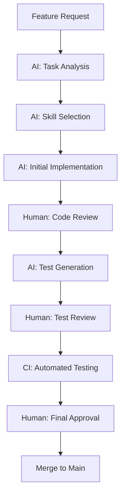
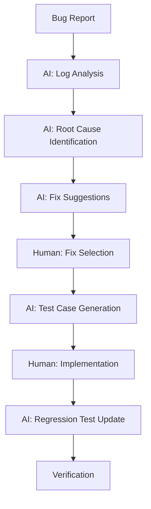
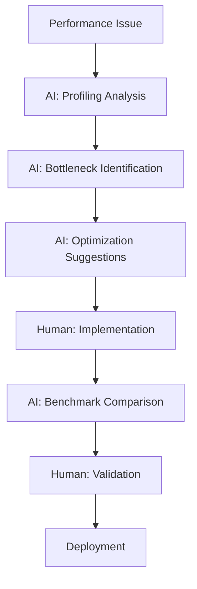

# AI Development Framework for Trading Platform

## 🎯 Overview

This document outlines how to leverage AI coding tools and agents to accelerate the development, testing, and deployment of the Trading Platform project. The framework provides structured approaches for using AI to drive each phase of the project forward.

## 📋 Table of Contents

1. [AI Integration Strategy](#ai-integration-strategy)
2. [AI Skills Architecture](#ai-skills-architecture)
3. [AI-Assisted Development Workflows](#ai-assisted-development-workflows)
4. [AI Testing Framework](#ai-testing-framework)
5. [AI Infrastructure Automation](#ai-infrastructure-automation)
6. [AI Code Review and Quality](#ai-code-review-and-quality)
7. [AI Documentation Generation](#ai-documentation-generation)
8. [Implementation Roadmap](#implementation-roadmap)

---

## 🤖 AI Integration Strategy

### Core Principles

1. **Augment, Don't Replace**: AI tools enhance human expertise, not replace it
2. **Iterative Refinement**: Use AI for rapid prototyping, then refine with human oversight
3. **Quality First**: AI-generated code must meet the same standards as human-written code
4. **Transparency**: All AI-generated content should be clearly marked and reviewed
5. **Learning Focus**: Use AI to accelerate learning of HFT technologies

### AI Tool Stack

| Tool Type | Purpose | Integration Point |
|-----------|---------|-------------------|
| **Coding Agents** | Code generation, refactoring | Development workflow |
| **Code Review Agents** | Quality assessment, best practices | PR review process |
| **Testing Agents** | Test generation, execution | CI/CD pipeline |
| **Documentation Agents** | Documentation generation | Documentation updates |
| **Infrastructure Agents** | IaC generation, deployment | DevOps workflow |
| **Analysis Agents** | Performance analysis, optimization | Profiling sessions |

### AI Usage Guidelines

✅ **DO Use AI for:**
- Boilerplate code generation
- Test case generation
- Documentation drafting
- Code refactoring suggestions
- Performance optimization ideas
- Bug detection and fixes
- Infrastructure as code templates

❌ **DON'T Use AI for:**
- Critical trading logic without human review
- Security-sensitive code
- Financial calculations without verification
- Production deployment without testing
- Complex architectural decisions

---

## 🏗️ AI Skills Architecture

### Skill-Based Development

The project uses a **skill-based architecture** where AI agents can be invoked with specific skills for different aspects of trading platform development.

```
┌─────────────────────────────────────────────────────────────┐
│                    AI Development Framework                     │
├─────────────────────────────────────────────────────────────┤
│                                                                  │
│  ┌──────────────┐  ┌──────────────┐  ┌──────────────┐      │
│  │  HFT Skills   │  │  Testing      │  │  DevOps       │      │
│  │  (Domain      │  │  Skills       │  │  Skills       │      │
│  │   Expertise)  │  │               │  │               │      │
│  └──────┬────────┘  └──────┬────────┘  └──────┬────────┘      │
│         │                 │                 │                 │
│         ▼                 ▼                 ▼                 │
│  ┌─────────────────────────────────────────────────────┐    │
│  │                    Skill Registry                        │    │
│  │  - Aeron Configuration Skill                           │    │
│  │  - SBE Schema Design Skill                              │    │
│  │  - Strategy Implementation Skill                         │    │
│  │  - Performance Optimization Skill                        │    │
│  │  - Test Generation Skill                                │    │
│  │  - Infrastructure Automation Skill                      │    │
│  └─────────────────────────────────────────────────────┘    │
│                                                                  │
│  ┌─────────────────────────────────────────────────────┐    │
│  │                    AI Agent Orchestrator                 │    │
│  │  - Task decomposition                                   │    │
│  │  - Skill selection                                      │    │
│  │  - Result validation                                    │    │
│  │  - Human-in-the-loop approval                           │    │
│  └─────────────────────────────────────────────────────┘    │
└─────────────────────────────────────────────────────────────┘
```

### Available AI Skills

#### 🎯 HFT Domain Skills

| Skill Name | Description | Use Cases |
|------------|-------------|-----------|
| `hft-aeron-setup` | Aeron media driver configuration | Setting up UDP multicast, buffer tuning |
| `hft-sbe-design` | SBE schema design and generation | Creating message schemas, code generation |
| `hft-market-data` | Market data pipeline implementation | Feed handlers, data normalization |
| `hft-strategy-framework` | Trading strategy framework | Algorithm base classes, lifecycle management |
| `hft-execution` | Order execution implementation | Exchange connectors, order management |
| `hft-risk-management` | Risk service implementation | Position limits, exposure monitoring |
| `hft-performance` | Performance optimization | Latency reduction, throughput improvement |

#### 🧪 Testing Skills

| Skill Name | Description | Use Cases |
|------------|-------------|-----------|
| `test-unit-generation` | Unit test generation | Creating test cases for components |
| `test-integration` | Integration test design | End-to-end testing, service interactions |
| `test-performance` | Performance test creation | Benchmarking, load testing |
| `test-latency` | Latency measurement tests | Microsecond-level timing verification |
| `test-regression` | Regression test generation | Ensuring changes don't break existing functionality |

#### ⚙️ DevOps Skills

| Skill Name | Description | Use Cases |
|------------|-------------|-----------|
| `devops-docker` | Docker configuration | Containerizing services, multi-stage builds |
| `devops-kubernetes` | Kubernetes deployment | Helm charts, scaling configurations |
| `devops-monitoring` | Monitoring setup | Prometheus, Grafana, alerting |
| `devops-ci-cd` | CI/CD pipeline creation | GitHub Actions, automated testing |
| `devops-infrastructure` | Infrastructure as code | Terraform, AWS deployment |

#### 📝 Documentation Skills

| Skill Name | Description | Use Cases |
|------------|-------------|-----------|
| `docs-architecture` | Architecture documentation | System design, component diagrams |
| `docs-api` | API documentation | REST APIs, message schemas |
| `docs-development` | Development guidelines | Coding standards, best practices |
| `docs-deployment` | Deployment guides | Setup instructions, troubleshooting |

---

## 🚀 AI-Assisted Development Workflows

### 1. Feature Development Workflow



**Example: Implementing a new feed handler**

```bash
# 1. Request AI assistance with specific skill
ai-develop --skill hft-market-data --task "Implement Binance WebSocket feed handler"

# 2. AI generates initial implementation
ai-develop --generate --template feed-handler --exchange binance

# 3. AI creates test cases
ai-test --generate --type unit --component BinanceFeedHandler

# 4. AI suggests performance optimizations
ai-optimize --component BinanceFeedHandler --target latency
```

### 2. Bug Fixing Workflow



### 3. Performance Optimization Workflow



---

## 🧪 AI Testing Framework

### Test Generation Strategy

#### 1. Unit Test Generation

**AI Prompt Template:**
```
Generate comprehensive unit tests for the following C# class:
[PASTE CLASS CODE]

Requirements:
- Use xUnit framework
- Follow Arrange-Act-Assert pattern
- Test all public methods
- Include edge cases and error conditions
- Mock all external dependencies
- Target 90%+ code coverage
- Include performance-critical path tests
```

**Example Output Structure:**
```csharp
// AI-Generated: Unit tests for MarketDataProcessor
// Generated: 2024-01-15
// Review Status: Pending

public class MarketDataProcessorTests
{
    [Fact]
    public void ProcessUpdate_ValidData_UpdatesCache()
    {
        // Arrange
        var processor = new MarketDataProcessor();
        var update = new MarketDataUpdate { /* ... */ };
        
        // Act
        processor.ProcessUpdate(update);
        
        // Assert
        Assert.Equal(expected, actual);
    }
    
    [Fact]
    public void ProcessUpdate_NullInput_ThrowsArgumentNullException()
    {
        // Arrange
        var processor = new MarketDataProcessor();
        
        // Act & Assert
        Assert.Throws<ArgumentNullException>(() => processor.ProcessUpdate(null));
    }
    
    // Additional tests...
}
```

#### 2. Integration Test Generation

**AI Prompt Template:**
```
Create integration tests for the market data pipeline that:
1. Tests the complete flow: SyntheticFeed -> Aeron -> MarketDataProcessor
2. Verifies message serialization/deserialization with SBE
3. Measures end-to-end latency
4. Tests error handling and recovery
5. Uses Docker Compose for test dependencies

Include:
- Test setup with Docker containers
- Message flow verification
- Latency measurement assertions
- Error injection tests
```

#### 3. Performance Test Generation

**AI Prompt Template:**
```
Generate performance benchmarks for Aeron message publishing:
- Measure publish latency for different message sizes
- Test throughput at 1k, 5k, 10k, 20k messages/sec
- Include memory allocation measurements
- Compare different buffer configurations
- Use BenchmarkDotNet framework

Target: <50μs publish latency, <1% GC time
```

### Test Quality Validation

AI-generated tests must pass the following validation:

1. **Compilation Check**: Tests must compile without errors
2. **Execution Check**: Tests must run and pass
3. **Coverage Check**: Tests must increase code coverage
4. **Relevance Check**: Tests must be relevant to the component
5. **Performance Check**: Tests must not significantly slow down the test suite

---

## ⚙️ AI Infrastructure Automation

### 1. Docker Configuration Generation

**AI Prompt Template:**
```
Generate Docker configuration for the TradingPlatform.FeedHandlers.Crypto service:
- Base image: mcr.microsoft.com/dotnet/aspnet:8.0
- Multi-stage build for production
- Expose port 8080 for metrics
- Environment variables for Aeron configuration
- Health checks for service readiness
- Optimized for low-latency performance
```

### 2. Kubernetes Deployment Generation

**AI Prompt Template:**
```
Create Helm chart for deploying the trading platform to Kubernetes:
- Separate deployments for each service
- ConfigMaps for configuration
- Horizontal Pod Autoscaler for stateless services
- StatefulSets for services with persistent data
- Network policies for service communication
- Resource limits and requests
- Liveness and readiness probes
```

### 3. CI/CD Pipeline Generation

**AI Prompt Template:**
```
Generate GitHub Actions workflow for the trading platform:
- Trigger on push to main and develop branches
- Build all .NET projects
- Run unit tests with coverage
- Run integration tests with Docker Compose
- Build and push Docker images to GitHub Container Registry
- Deploy to AWS EKS for production
- Include manual approval for production deployment
```

### 4. Monitoring Configuration Generation

**AI Prompt Template:**
```
Create Prometheus and Grafana configuration for monitoring:
- Prometheus scrape configs for all services
- Custom metrics for trading-specific data
- Alert rules for critical conditions
- Grafana dashboards for:
  - Feed handlers (throughput, latency, errors)
  - Trading algorithms (signals, orders, P&L)
  - Execution services (order flow, fill rates)
  - Risk service (limits, breaches, actions)
  - System overview (resource usage, health)
```

---

## 🔍 AI Code Review and Quality

### Code Review Checklist

AI agents should validate code against the following criteria:

#### 📝 General Quality
- [ ] Follows project coding standards
- [ ] Proper error handling
- [ ] Appropriate logging
- [ ] Clear and descriptive naming
- [ ] Proper documentation

#### ⚡ Performance
- [ ] Minimizes allocations in hot paths
- [ ] Uses appropriate data structures
- [ ] Avoids boxing/unboxing
- [ ] Proper async/await usage
- [ ] Thread-safe where required

#### 🛡️ Security
- [ ] No hardcoded secrets
- [ ] Proper input validation
- [ ] Secure configuration handling
- [ ] Appropriate access controls

#### 🧪 Testability
- [ ] Testable design (dependency injection)
- [ ] Mockable dependencies
- [ ] Clear separation of concerns
- [ ] Proper interfaces for testing

### AI Code Review Process

1. **Static Analysis**: AI runs static code analysis
2. **Pattern Matching**: AI checks against best practices
3. **Context Understanding**: AI analyzes the broader context
4. **Suggestion Generation**: AI provides specific improvement suggestions
5. **Human Review**: Human developer reviews and approves/rejects suggestions

---

## 📚 AI Documentation Generation

### Documentation Types

#### 1. Architecture Decision Records (ADRs)

**AI Prompt Template:**
```
Create an ADR for the decision to use Aeron over other messaging systems:
- Context: Need for low-latency messaging in trading platform
- Decision: Use Aeron with UDP multicast
- Alternatives considered: NATS, RabbitMQ, Kafka, custom UDP
- Consequences: Pros and cons of the decision
- Related: Performance requirements, technology stack
```

#### 2. API Documentation

**AI Prompt Template:**
```
Generate API documentation for the ITradingAlgorithm interface:
- Method descriptions
- Parameter explanations
- Return value descriptions
- Usage examples
- Thread safety notes
- Performance considerations
```

#### 3. Development Guides

**AI Prompt Template:**
```
Create a development guide for implementing new trading strategies:
- Prerequisites
- Step-by-step implementation
- Integration with existing components
- Testing requirements
- Performance considerations
- Common pitfalls and solutions
```

---

## 🗺️ Implementation Roadmap

### Phase 1: AI Foundation (Week 1)

**Objective**: Set up AI development framework and generate initial scaffolding

- [ ] Create AI skills registry and configuration
- [ ] Set up AI agent orchestration system
- [ ] Generate project scaffolding with AI assistance
- [ ] Create AI-assisted development workflows
- [ ] Establish code review and quality processes

**AI Tasks:**
```bash
# Generate project structure
ai-generate --template trading-platform --language csharp --framework dotnet8

# Create initial SBE schemas
ai-develop --skill hft-sbe-design --task "Create market data schema"

# Generate base classes
ai-develop --skill hft-aeron-setup --task "Create Aeron wrapper classes"
```

### Phase 2: Core Pipeline with AI (Weeks 2-3)

**Objective**: Implement core messaging pipeline with AI assistance

- [ ] AI-generated SBE schema and code generation
- [ ] AI-assisted Aeron wrapper implementation
- [ ] AI-generated synthetic feed implementation
- [ ] AI-created unit and integration tests
- [ ] AI-suggested performance optimizations

**AI Tasks:**
```bash
# Generate SBE schema
ai-develop --skill hft-sbe-design --schema market_data_simple.xml

# Implement Aeron publisher
ai-develop --skill hft-aeron-setup --component AeronPublisher

# Create synthetic feed
ai-develop --skill hft-market-data --component SyntheticFeed

# Generate tests
ai-test --generate --component AeronPublisher --type unit
ai-test --generate --component SyntheticFeed --type integration
```

### Phase 3: Strategy Framework with AI (Weeks 4-5)

**Objective**: Implement trading strategy framework with AI assistance

- [ ] AI-designed strategy interface and base classes
- [ ] AI-generated example strategies (Market Making, Stat Arb)
- [ ] AI-created execution simulator
- [ ] AI-generated comprehensive test suite
- [ ] AI-suggested performance improvements

**AI Tasks:**
```bash
# Design strategy framework
ai-develop --skill hft-strategy-framework --task "Create ITradingAlgorithm interface"

# Implement market making strategy
ai-develop --skill hft-strategy-framework --strategy market-making

# Create execution simulator
ai-develop --skill hft-execution --component ExecutionSimulator

# Generate strategy tests
ai-test --generate --component MarketMakingStrategy --type unit
ai-test --generate --flow "Feed->Strategy->Execution" --type integration
```

### Phase 4: Scale and Optimize with AI (Weeks 6-7)

**Objective**: Scale the system and optimize performance with AI assistance

- [ ] AI-identified bottlenecks and optimization opportunities
- [ ] AI-suggested Aeron configuration tuning
- [ ] AI-generated performance benchmarks
- [ ] AI-assisted memory and GC optimization
- [ ] AI-created load testing scenarios

**AI Tasks:**
```bash
# Analyze performance
ai-optimize --analyze --component AeronPublisher --metric latency

# Suggest optimizations
ai-optimize --suggest --target "20k messages/sec" --constraint "<100μs latency"

# Generate benchmarks
ai-test --generate --type performance --component AeronPublisher

# Create load tests
ai-test --generate --type load --scenario "10k messages/sec"
```

### Phase 5: Infrastructure and Deployment with AI (Week 8)

**Objective**: Set up infrastructure and deployment with AI assistance

- [ ] AI-generated Docker configurations
- [ ] AI-created Kubernetes deployment manifests
- [ ] AI-designed CI/CD pipelines
- [ ] AI-configured monitoring and alerting
- [ ] AI-optimized AWS deployment

**AI Tasks:**
```bash
# Generate Docker files
ai-devops --generate --type docker --service TradingPlatform.FeedHandlers.Crypto

# Create Kubernetes manifests
ai-devops --generate --type kubernetes --all-services

# Generate CI/CD pipeline
ai-devops --generate --type ci-cd --platform github-actions

# Create monitoring config
ai-devops --generate --type monitoring --include prometheus,grafana
```

---

## 📊 Success Metrics

### AI Effectiveness Metrics

| Metric | Target | Measurement |
|--------|--------|-------------|
| Code Generation Speed | 10x faster | Time to implement features |
| Test Coverage | 90%+ | Automated test coverage |
| Bug Detection Rate | 80%+ | Bugs caught by AI before human review |
| Optimization Success | 30%+ | Performance improvements from AI suggestions |
| Documentation Completeness | 100% | All components have AI-generated docs |

### Development Metrics

| Metric | Target | Measurement |
|--------|--------|-------------|
| Feature Implementation Time | <2 days | Time from request to merge |
| Bug Fix Time | <1 hour | Time from report to fix |
| Test Suite Runtime | <5 minutes | Total test execution time |
| Build Success Rate | 99%+ | Percentage of successful builds |

---

## 🔧 Tools and Integration

### Recommended AI Tools

1. **GitHub Copilot**: In-IDE code generation and suggestions
2. **GitHub Advanced Security**: Code scanning and vulnerability detection
3. **Custom AI Agents**: Domain-specific trading platform agents
4. **LangChain**: For orchestrating multiple AI models
5. **LlamaIndex**: For indexing and searching project documentation

### Integration Points

1. **IDE Integration**: AI assistance directly in VS Code/Rider
2. **CI/CD Integration**: AI-powered code review in GitHub Actions
3. **Documentation Integration**: AI-generated docs in GitHub Wiki
4. **Monitoring Integration**: AI-powered anomaly detection in Prometheus
5. **Deployment Integration**: AI-assisted deployment decisions

---

## 📝 Best Practices

### 1. Human Oversight
- Always review AI-generated code before merging
- Verify AI suggestions against project requirements
- Test AI-generated code thoroughly
- Document AI usage in commit messages

### 2. Quality Standards
- AI-generated code must meet the same standards as human-written code
- Include AI-generated code in code reviews
- Run full test suite on AI-generated code
- Profile performance of AI-generated code

### 3. Continuous Improvement
- Track AI effectiveness metrics
- Refine AI prompts based on results
- Update AI skills based on project evolution
- Share successful AI patterns with the team

### 4. Transparency
- Clearly mark AI-generated content
- Document AI usage in project documentation
- Track AI contributions in version control
- Be transparent about AI limitations

---

## 🚀 Getting Started

### 1. Set Up AI Development Environment

```bash
# Install required tools
dotnet tool install --global ai-development-cli
npm install -g @trading-platform/ai-skills

# Initialize AI framework in project
ai-init --project trading-platform --language csharp

# Configure AI skills
ai-skill add hft-aeron-setup
ai-skill add hft-sbe-design
ai-skill add hft-market-data
# ... add all required skills
```

### 2. Start Using AI Assistance

```bash
# Get AI help with a specific task
ai-help --task "Implement Binance feed handler"

# Generate code with AI
ai-generate --component BinanceFeedHandler --template feed-handler

# Review code with AI
ai-review --file src/FeedHandlers/Crypto/BinanceFeedHandler.cs

# Optimize code with AI
ai-optimize --component BinanceFeedHandler --target performance
```

---

## 📞 Support and Resources

### AI Skill Documentation
- [HFT Skills Guide](./skills/hft_skills.md)
- [Testing Skills Guide](./skills/testing_skills.md)
- [DevOps Skills Guide](./skills/devops_skills.md)

### Templates and Examples
- [AI Prompt Templates](./templates/prompts.md)
- [Code Generation Templates](./templates/code_generation.md)
- [Test Generation Examples](./templates/test_examples.md)

### Community
- Share successful AI patterns
- Report AI skill issues
- Suggest new AI skills
- Contribute to AI skill development

---

*Document Version: 1.0*
*Last Updated: 2024*
*Maintainer: Trading Platform Team*
