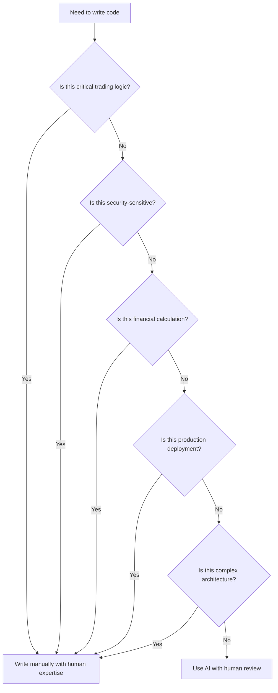

# AI Development Guidelines for Trading Platform

## 🎯 Overview

This document provides **comprehensive guidelines** for using AI coding tools in the Trading Platform project. It establishes best practices, quality standards, and workflows to ensure that AI-generated code meets the project's requirements for performance, reliability, and maintainability.

## 📋 Table of Contents

1. [AI Usage Principles](#ai-usage-principles)
2. [Code Generation Guidelines](#code-generation-guidelines)
3. [Quality Assurance with AI](#quality-assurance-with-ai)
4. [Performance Considerations](#performance-considerations)
5. [Security Guidelines](#security-guidelines)
6. [Testing with AI](#testing-with-ai)
7. [Documentation with AI](#documentation-with-ai)
8. [Code Review with AI](#code-review-with-ai)
9. [Debugging with AI](#debugging-with-ai)
10. [Continuous Improvement](#continuous-improvement)

---

## 🤖 AI Usage Principles

### Core Principles

1. **Augment, Don't Replace**: AI tools enhance human expertise, not replace it
2. **Human Oversight Required**: All AI-generated code must be reviewed by humans
3. **Quality First**: AI-generated code must meet the same standards as human-written code
4. **Transparency**: Clearly mark and document AI usage
5. **Learning Focus**: Use AI to accelerate learning of HFT technologies
6. **Risk Awareness**: Be cautious with AI in critical trading logic

### When to Use AI

#### ✅ **DO Use AI for:**

| Category | Examples | Benefits |
|----------|----------|----------|
| **Boilerplate Code** | DTOs, models, interfaces, configuration classes | Saves time, reduces errors |
| **Test Generation** | Unit tests, integration tests, test data | Increases coverage, finds edge cases |
| **Documentation** | API docs, code comments, development guides | Improves documentation quality |
| **Infrastructure** | Docker files, Kubernetes manifests, CI/CD pipelines | Accelerates DevOps tasks |
| **Code Refactoring** | Improving code structure, applying design patterns | Enhances code quality |
| **Performance Analysis** | Profiling, bottleneck identification, optimization suggestions | Improves system performance |
| **Debugging Assistance** | Log analysis, error diagnosis, root cause identification | Speeds up troubleshooting |
| **Code Review** | Quality checks, best practice validation, security scanning | Improves code review efficiency |

#### ❌ **DON'T Use AI for:**

| Category | Examples | Risks |
|----------|----------|-------|
| **Critical Trading Logic** | Order execution, risk calculations, pricing algorithms | Financial risk, incorrect behavior |
| **Security-Sensitive Code** | Authentication, encryption, API keys, secrets management | Security vulnerabilities, data breaches |
| **Financial Calculations** | P&L calculations, risk metrics, valuation models | Financial inaccuracies, compliance issues |
| **Production Deployment** | Deployment scripts, infrastructure changes | System downtime, data loss |
| **Complex Architecture** | System design, component boundaries, integration patterns | Poor design decisions, technical debt |
| **Legal/Compliance Code** | Regulatory reporting, audit trails, compliance checks | Legal violations, audit failures |

### AI Usage Decision Tree

---

## 📝 Code Generation Guidelines

### Code Generation Process

#### 1. Preparation Phase

**Before generating code with AI:**

- [ ] **Define Requirements Clearly**: Write detailed requirements and specifications
- [ ] **Identify Dependencies**: List all dependencies and interfaces
- [ ] **Review Existing Code**: Understand the current codebase patterns
- [ ] **Set Quality Standards**: Define what 