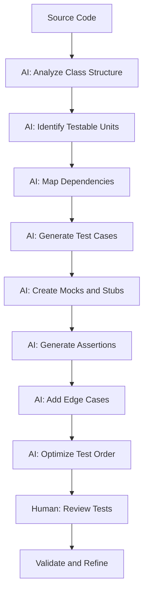

# AI-Driven Testing Strategy for Trading Platform

## 🎯 Overview

This document outlines the **AI-driven testing strategy** for the Trading Platform project. It describes how to leverage AI tools to generate comprehensive, high-quality tests that ensure the reliability, performance, and correctness of the HFT learning platform.

## 📋 Table of Contents

1. [Testing Philosophy](#testing-philosophy)
2. [AI Testing Framework](#ai-testing-framework)
3. [Test Generation Strategies](#test-generation-strategies)
4. [Test Types and AI Integration](#test-types-and-ai-integration)
5. [AI Test Generation Workflows](#ai-test-generation-workflows)
6. [Test Quality Assurance](#test-quality-assurance)
7. [Performance Testing with AI](#performance-testing-with-ai)
8. [Integration and E2E Testing](#integration-and-e2e-testing)
9. [Test Maintenance and Evolution](#test-maintenance-and-evolution)
10. [Success Metrics](#success-metrics)

---

## 🏗️ Testing Philosophy

### Core Principles

1. **Quality First**: AI-generated tests must meet the same quality standards as human-written tests
2. **Comprehensive Coverage**: Aim for 90%+ code coverage with meaningful tests
3. **Performance Focus**: Tests must not significantly impact development velocity
4. **Maintainability**: Generated tests should be easy to understand and maintain
5. **Relevance**: Tests should focus on critical paths and edge cases
6. **Determinism**: Tests should be deterministic and reliable

### AI Testing Goals

| Goal | Target | Measurement |
|------|--------|-------------|
| **Test Coverage** | 90%+ | Code coverage analysis |
| **Test Quality** | 95%+ | Test effectiveness metrics |
| **Test Generation Speed** | 10x faster | Time to generate tests |
| **Bug Detection Rate** | 80%+ | Bugs caught by AI tests |
| **Test Reliability** | 99%+ | Test pass rate |
| **Test Maintenance** | <10% | Percentage of tests requiring manual updates |

### Testing Pyramid with AI

```
                    ┌─────────────────┐
                    │   E2E Tests      │  ← AI-assisted scenario generation
                    │   (10-20 tests)  │
                    └────────┬────────┘
                             │
                    ┌────────▼────────┐
                    │ Integration Tests │  ← AI-generated service interaction tests
                    │   (50-100 tests) │
                    └────────┬────────┘
                             │
                    ┌────────▼────────┐
                    │   Unit Tests     │  ← AI-generated comprehensive unit tests
                    │  (200-500 tests) │
                    └─────────────────┘
```

---

## 🤖 AI Testing Framework

### Framework Architecture

```
┌─────────────────────────────────────────────────────────────────────────────┐
│                        AI Testing Framework                                    │
├─────────────────────────────────────────────────────────────────────────────┤
│                                                                              │
│  ┌─────────────────┐    ┌─────────────────┐    ┌─────────────────┐      │
│  │  Test Analyzer   │    │  Test Generator  │    │  Test Validator  │      │
│  │                 │    │                 │    │                 │      │
│  │ - Code analysis │    │ - Unit tests    │    │ - Compilation   │      │
│  │ - Coverage gaps  │    │ - Integration    │    │ - Execution     │      │
│  │ - Complexity    │    │ - Performance    │    │ - Coverage      │      │
│  │ - Dependencies  │    │ - Edge cases     │    │ - Quality       │      │
│  └────────┬────────┘    └────────┬────────┘    └────────┬────────┘      │
│            │                   │                   │                 │
│            ▼                   ▼                   ▼                 │
│  ┌─────────────────────────────────────────────────────────────────────┐   │
│  │                        Test Orchestrator                               │   │
│  │  - Test selection and prioritization                               │   │
│  │  - Test execution scheduling                                        │   │
│  │  - Resource allocation                                              │   │
│  │  - Result aggregation and reporting                                  │   │
│  └─────────────────────────────────────────────────────────────────────┘   │
│                                                                              │
│  ┌─────────────────────────────────────────────────────────────────────┐   │
│  │                        Test Repository                                 │   │
│  │  - Generated test files                                              │   │
│  │  - Test templates and patterns                                       │   │
│  │  - Test configuration and data                                        │   │
│  │  - Historical test results                                            │   │
│  └─────────────────────────────────────────────────────────────────────┘   │
│                                                                              │
└─────────────────────────────────────────────────────────────────────────────┘
```

### Framework Components

#### 1. Test Analyzer

**Responsibilities:**
- Analyze source code to identify testable units
- Detect code coverage gaps
- Identify complex logic requiring thorough testing
- Map dependencies between components
- Prioritize testing efforts based on risk

**AI Capabilities:**
- Static code analysis
- Control flow analysis
- Dependency graph generation
- Complexity metric calculation
- Risk assessment

#### 2. Test Generator

**Responsibilities:**
- Generate unit tests for classes and methods
- Create integration tests for service interactions
- Develop performance benchmarks
- Generate test data and scenarios
- Create edge case and error condition tests

**AI Capabilities:**
- Test case generation from code
- Test data generation
- Scenario creation
- Mock and stub generation
- Assertion generation

#### 3. Test Validator

**Responsibilities:**
- Validate generated test compilation
- Verify test execution and results
- Check test coverage effectiveness
- Assess test quality metrics
- Ensure test maintainability

**AI Capabilities:**
- Compilation checking
- Test execution monitoring
- Coverage analysis
- Quality metric calculation
- Maintainability assessment

#### 4. Test Orchestrator

**Responsibilities:**
- Coordinate test generation and execution
- Manage test dependencies
- Optimize test execution order
- Handle test parallelization
- Aggregate and report results

**AI Capabilities:**
- Dependency analysis
- Execution planning
- Resource optimization
- Parallel execution management
- Result aggregation

---

## 🎯 Test Generation Strategies

### 1. Unit Test Generation Strategy

#### AI Prompt Template for Unit Tests

```
Generate comprehensive unit tests for the following C# class:

[PASTE CLASS CODE HERE]

Requirements:
1. Framework: Use xUnit framework
2. Pattern: Follow Arrange-Act-Assert pattern strictly
3. Coverage: Test all public methods, properties, and events
4. Edge Cases: Include tests for:
   - Null inputs
   - Empty collections
   - Boundary values (min, max, zero, negative)
   - Invalid arguments
   - Exception conditions
   - Concurrent access (if applicable)
5. Mocking: Use Moq for all external dependencies
6. Quality: 
   - Each test should have a clear, descriptive name
   - Include comments explaining complex test logic
   - Use TestCaseData for parameterized tests where appropriate
   - Follow the project's coding standards
7. Performance: 
   - Tests should execute quickly (<100ms each)
   - Avoid I/O operations in unit tests
   - Use mocks for external services
8. Coverage Target: 95%+ code coverage for the class

Additional Context:
- This is a high-frequency trading system
- Performance is critical - focus on hot paths
- Thread safety is important for many components
- Error handling should be thoroughly tested

Output Format:
- Generate a single C# file with all tests
- Include necessary using directives
- Use proper namespace matching the class under test
- Include XML documentation comments
```

#### Unit Test Generation Process



#### Example Generated Unit Test

```csharp
// AI-Generated: Unit tests for MarketDataProcessor
// Generated: 2024-01-15 10:30:00
// Review Status: Pending
// Coverage Target: 95%+

using System;
using System.Collections.Generic;
using Moq;
using Xunit;
using TradingPlatform.Common.Models;
using TradingPlatform.MarketData;

namespace TradingPlatform.MarketData.Tests
{
    public class MarketDataProcessorTests
    {
        private readonly Mock<ILogger<MarketDataProcessor>> _loggerMock;
        private readonly Mock<IMarketDataCache> _cacheMock;
        private readonly MarketDataProcessor _processor;

        public MarketDataProcessorTests()
        {
            _loggerMock = new Mock<ILogger<MarketDataProcessor>>();
            _cacheMock = new Mock<IMarketDataCache>();
            _processor = new MarketDataProcessor(_loggerMock.Object, _cacheMock.Object);
        }

        [Fact]
        public void ProcessUpdate_ValidMarketDataUpdate_UpdatesCache()
        {
            // Arrange
            var update = new MarketDataUpdate
            {
                Symbol = "BTCUSDT",
                BidPrice = 50000.0,
                BidSize = 1.5,
                AskPrice = 50001.0,
                AskSize = 2.0,
                Timestamp = DateTime.UtcNow.Ticks
            };

            // Act
            _processor.ProcessUpdate(update);

            // Assert
            _cacheMock.Verify(c => c.UpdateTicker(
                It.Is<MarketDataUpdate>(u => 
                    u.Symbol == "BTCUSDT" && 
                    u.BidPrice == 50000.0 && 
                    u.AskPrice == 50001.0)),
                Times.Once);
        }

        [Fact]
        public void ProcessUpdate_NullUpdate_ThrowsArgumentNullException()
        {
            // Arrange & Act & Assert
            var exception = Assert.Throws<ArgumentNullException>(() => 
                _processor.ProcessUpdate(null));
            
            Assert.Equal("update", exception.ParamName);
        }

        [Theory]
        [InlineData("")]
        [InlineData(null)]
        [InlineData("   ")]
        public void ProcessUpdate_EmptySymbol_LogsWarningAndSkipsProcessing(string emptySymbol)
        {
            // Arrange
            var update = new MarketDataUpdate
            {
                Symbol = emptySymbol,
                BidPrice = 50000.0,
                Timestamp = DateTime.UtcNow.Ticks
            };

            // Act
            _processor.ProcessUpdate(update);

            // Assert
            _loggerMock.Verify(l => l.Log(
                LogLevel.Warning,
                It.IsAny<EventId>(),
                It.Is<It.IsAnyType>((v, t) => v.ToString().Contains("Empty or null symbol")),
                It.IsAny<Exception>(),
                It.Is<Func<It.IsAnyType, Exception, string>>((v, t) => true)),
                Times.Once);
            
            _cacheMock.Verify(c => c.UpdateTicker(It.IsAny<MarketDataUpdate>()), Times.Never);
        }

        [Fact]
        public void ProcessUpdate_ValidUpdateWithZeroPrices_LogsWarning()
        {
            // Arrange
            var update = new MarketDataUpdate
            {
                Symbol = "BTCUSDT",
                BidPrice = 0.0,
                AskPrice = 0.0,
                Timestamp = DateTime.UtcNow.Ticks
            };

            // Act
            _processor.ProcessUpdate(update);

            // Assert
            _loggerMock.Verify(l => l.Log(
                LogLevel.Warning,
                It.IsAny<EventId>(),
                It.Is<It.IsAnyType>((v, t) => v.ToString().Contains("Zero or negative price")),
                It.IsAny<Exception>(),
                It.Is<Func<It.IsAnyType, Exception, string>>((v, t) => true)),
                Times.Once);
        }

        [Fact]
        public void ProcessUpdate_ConcurrentCalls_ThreadSafe()
        {
            // Arrange
            var updates = new List<MarketDataUpdate>();
            for (int i = 0; i < 100; i++)
            {
                updates.Add(new MarketDataUpdate
                {
                    Symbol = $"SYMBOL{i}",
                    BidPrice = 50000.0 + i,
                    AskPrice = 50001.0 + i,
                    Timestamp = DateTime.UtcNow.Ticks
                });
            }

            // Act
            Parallel.ForEach(updates, update => 
            {
                _processor.ProcessUpdate(update);
            });

            // Assert - No exceptions thrown and cache updated for all
            _cacheMock.Verify(c => c.UpdateTicker(It.IsAny<MarketDataUpdate>()), 
                Times.Exactly(100));
        }
    }
}
```

### 2. Integration Test Generation Strategy

#### AI Prompt Template for Integration Tests

```
Create integration tests for the market data pipeline that tests the complete flow:
SyntheticFeed -> Aeron -> MarketDataProcessor -> MarketDataCache

Requirements:
1. Framework: Use xUnit framework
2. Setup: Use Docker Compose for test dependencies
   - Aeron media driver container
   - Prometheus container for metrics (optional)
3. Test Scenarios:
   - Normal message flow from feed to cache
   - Message serialization/deserialization with SBE
   - Error handling and recovery
   - Performance under load (1k, 5k messages/sec)
   - Message ordering and sequencing
4. Verification:
   - Message integrity (data not corrupted)
   - End-to-end latency measurement
   - All components receive and process messages
   - Error conditions handled properly
5. Cleanup: Proper teardown of Docker containers and resources
6. Performance: Tests should complete within reasonable time

Additional Context:
- This is testing a high-frequency trading system
- Focus on message integrity and performance
- Use UDP multicast for Aeron communication
- Test with realistic message rates

Output Format:
- Generate C# integration test classes
- Include Docker Compose configuration for test dependencies
- Use proper async/await patterns
- Include timeout handling
```

#### Example Generated Integration Test

```csharp
// AI-Generated: Integration tests for Market Data Pipeline
// Generated: 2024-01-15 10:30:00
// Review Status: Pending

using System;
using System.Threading.Tasks;
using Docker.Compose.Cli;
using Docker.Compose.Model;
using Xunit;
using TradingPlatform.Common.Aeron;
using TradingPlatform.FeedHandlers.Synthetic;
using TradingPlatform.MarketData;

namespace TradingPlatform.Integration.Tests
{
    public class MarketDataPipelineIntegrationTests : IAsyncLifetime
    {
        private readonly DockerComposeFixture _docker;
        private AeronPublisher _publisher;
        private AeronSubscriber _subscriber;
        private SyntheticFeed _syntheticFeed;
        private MarketDataProcessor _processor;
        private MarketDataCache _cache;

        public MarketDataPipelineIntegrationTests()
        {
            _docker = new DockerComposeFixture(
                new DockerComposeConfig
                {
                    FilePath = "docker-compose.test.yml",
                    ProjectName = "trading-platform-test"
                });
        }

        public async Task InitializeAsync()
        {
            // Start Docker containers
            await _docker.StartAsync();
            
            // Initialize Aeron
            _publisher = new AeronPublisher("udp://239.255.255.250:40123");
            _subscriber = new AeronSubscriber("udp://239.255.255.250:40123");
            
            // Initialize components
            _cache = new MarketDataCache();
            _processor = new MarketDataProcessor(_cache);
            _syntheticFeed = new SyntheticFeed(
                new[] { "BTCUSDT", "ETHUSDT" },
                1000); // 1000 messages/sec
            
            // Subscribe to Aeron messages
            _subscriber.Subscribe(message => 
            {
                _processor.ProcessUpdate(message);
            });
        }

        public async Task DisposeAsync()
        {
            _syntheticFeed?.Dispose();
            _publisher?.Dispose();
            _subscriber?.Dispose();
            await _docker.StopAsync();
        }

        [Fact]
        public async Task MarketDataPipeline_EndToEndFlow_MessagesProcessedCorrectly()
        {
            // Arrange
            var expectedSymbols = new[] { "BTCUSDT", "ETHUSDT" };
            var completionSource = new TaskCompletionSource<bool>();
            var messagesReceived = 0;
            
            _subscriber.MessageReceived += (sender, args) =>
            {
                messagesReceived++;
                if (messagesReceived >= 10) // Wait for 10 messages
                {
                    completionSource.SetResult(true);
                }
            };

            // Act
            _syntheticFeed.Start();
            await completionSource.Task.WaitAsync(TimeSpan.FromSeconds(5));

            // Assert
            Assert.True(messagesReceived >= 10, "Should receive at least 10 messages");
            
            foreach (var symbol in expectedSymbols)
            {
                var ticker = _cache.GetTicker(symbol);
                Assert.NotNull(ticker);
                Assert.True(ticker.BidPrice > 0);
                Assert.True(ticker.AskPrice > 0);
            }
        }

        [Fact]
        public async Task MarketDataPipeline_Latency_MeetsPerformanceTarget()
        {
            // Arrange
            var latencies = new System.Collections.Concurrent.ConcurrentBag<long>();
            var completionSource = new TaskCompletionSource<bool>();
            var messageCount = 0;
            const int targetMessageCount = 100;

            _subscriber.MessageReceived += (sender, args) =>
            {
                latencies.Add(args.LatencyNanoseconds);
                messageCount++;
                if (messageCount >= targetMessageCount)
                {
                    completionSource.SetResult(true);
                }
            };

            // Act
            _syntheticFeed.Start();
            await completionSource.Task.WaitAsync(TimeSpan.FromSeconds(10));

            // Assert
            Assert.True(messageCount >= targetMessageCount, 
                "Should receive enough messages for latency test");
            
            // Calculate average latency
            long totalLatency = 0;
            foreach (var latency in latencies)
            {
                totalLatency += latency;
            }
            var averageLatencyNs = totalLatency / targetMessageCount;
            var averageLatencyUs = averageLatencyNs / 1000.0;
            
            // Target: <100μs end-to-end latency
            Assert.True(averageLatencyUs < 100, 
                $