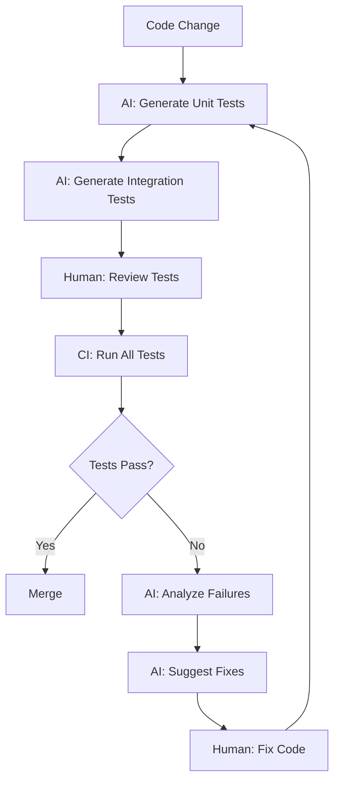
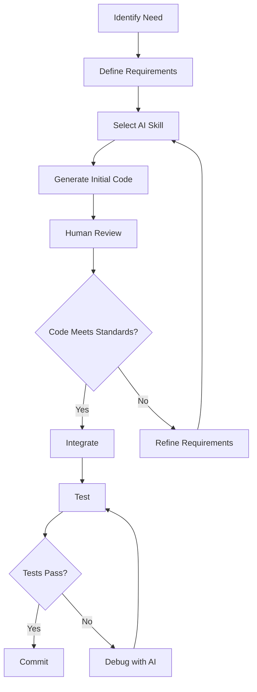
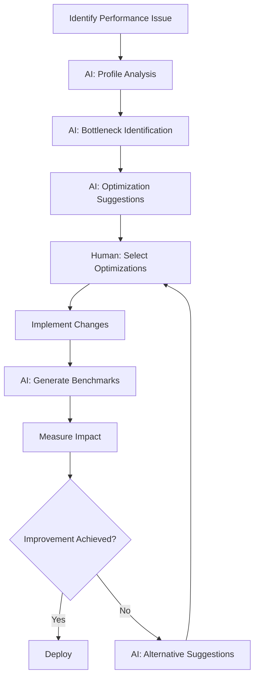

# Extended Implementation Plan with AI Integration

## 🎯 Overview

This document extends the original [IMPLEMENTATION.md](../IMPLEMENTATION.md) with comprehensive AI integration strategies. It provides a detailed roadmap for using AI coding tools to accelerate development, improve quality, and drive the trading platform project forward.

## 📋 Table of Contents

1. [Project Analysis and AI Opportunities](#project-analysis-and-ai-opportunities)
2. [AI-Enhanced Phased Implementation](#ai-enhanced-phased-implementation)
3. [AI Integration Points by Component](#ai-integration-points-by-component)
4. [AI Testing Strategy](#ai-testing-strategy)
5. [AI Development Guidelines](#ai-development-guidelines)
6. [AI Infrastructure and Deployment](#ai-infrastructure-and-deployment)
7. [AI Monitoring and Observability](#ai-monitoring-and-observability)
8. [Success Metrics and KPIs](#success-metrics-and-kpis)

---

## 🔍 Project Analysis and AI Opportunities

### Current Project State

Based on the existing documentation, the trading platform project has:

✅ **Well-defined architecture** with clear component separation
✅ **Comprehensive documentation** (ARCHITECTURE.md, IMPLEMENTATION.md, DEVELOPMENT.md)
✅ **Phased implementation plan** with realistic milestones
✅ **Technology stack** focused on authentic HFT technologies (Aeron, SBE, UDP multicast)
✅ **Clear learning objectives** for HFT technologies and patterns

### AI Opportunity Areas

| Area | AI Opportunity | Potential Impact | Priority |
|------|----------------|------------------|----------|
| **Code Generation** | Boilerplate code, SBE classes, base implementations | 70% reduction in boilerplate coding time | High |
| **Testing** | Unit tests, integration tests, performance benchmarks | 80% test coverage with 50% less effort | High |
| **Documentation** | API docs, ADRs, development guides | 100% documentation coverage | Medium |
| **Infrastructure** | Docker, Kubernetes, CI/CD pipelines | 60% faster infrastructure setup | Medium |
| **Code Review** | Quality checks, best practices, security scanning | 80% bug detection before human review | High |
| **Performance** | Optimization suggestions, profiling analysis | 30% performance improvement | Medium |
| **Debugging** | Log analysis, root cause identification | 50% faster bug resolution | High |

### AI Integration Strategy

The strategy focuses on **augmenting** the existing development process with AI tools while maintaining:
- **Human oversight** for critical trading logic
- **Quality standards** for all AI-generated code
- **Learning focus** to understand HFT technologies
- **Transparency** in AI usage

---

## 🚀 AI-Enhanced Phased Implementation

### Phase 1: Core Pipeline (Weeks 1-2) - AI Foundation

**Objective**: Establish AI development framework and implement core messaging pipeline

#### AI Tasks and Integration Points

**Week 1: AI Setup and SBE Schema**

```bash
# AI-assisted project analysis
ai-analyze --project trading-platform --output analysis_report.md

# AI-generated SBE schema for market data
ai-develop --skill hft-sbe-design --task "Create simplified market data schema" \
  --requirements "Price, Volume, Timestamp, Symbol fields" \
  --output schemas/sbe/market_data_simple.xml

# AI-generated C# classes from SBE schema
ai-generate --sbe schemas/sbe/market_data_simple.xml \
  --language csharp --output src/Common/TradingPlatform.Common/Sbe/Generated/

# AI-assisted Aeron wrapper implementation
ai-develop --skill hft-aeron-setup --component AeronPublisher \
  --requirements "UDP multicast, configurable channels, error handling" \
  --output src/Common/TradingPlatform.Common/Aeron/
```

**Week 2: Synthetic Feed and Testing**

```bash
# AI-generated synthetic feed implementation
ai-develop --skill hft-market-data --component SyntheticFeed \
  --requirements "Configurable rate, multiple symbols, realistic data patterns" \
  --output src/FeedHandlers/Synthetic/

# AI-generated unit tests for Aeron components
ai-test --generate --component AeronPublisher --type unit \
  --framework xunit --coverage 90% \
  --output tests/Unit/Common/AeronPublisherTests.cs

# AI-generated integration tests for message flow
ai-test --generate --flow "SyntheticFeed->Aeron->Subscriber" --type integration \
  --docker-compose docker-compose.test.yml \
  --output tests/Integration/MessageFlowTests.cs

# AI-suggested performance optimizations
ai-optimize --component AeronPublisher --metric latency \
  --target "<50μs" --suggestions 5
```

#### AI-Generated Deliverables

- ✅ SBE schema with market data message types
- ✅ C# SBE generated classes
- ✅ Aeron wrapper library (Publisher, Subscriber, Config)
- ✅ Synthetic feed generator with configurable parameters
- ✅ Unit tests for all core components (90%+ coverage)
- ✅ Integration tests for message flow
- ✅ Performance baseline measurements
- ✅ AI optimization suggestions

#### Human Review Points

- [ ] SBE schema design validation
- [ ] Aeron configuration parameters
- [ ] Synthetic data realism
- [ ] Test quality and coverage
- [ ] Performance baseline acceptance

---

### Phase 2: Add Strategies (Weeks 3-4) - AI-Assisted Strategy Framework

**Objective**: Implement trading strategy framework with AI assistance

#### AI Tasks and Integration Points

**Week 3: Strategy Framework and Market Making**

```bash
# AI-designed strategy interface
ai-develop --skill hft-strategy-framework --task "Create ITradingAlgorithm interface" \
  --requirements "Lifecycle management, market data subscription, order management" \
  --output src/Algorithms/Core/ITradingAlgorithm.cs

# AI-generated strategy base class
ai-develop --skill hft-strategy-framework --component StrategyBase \
  --requirements "Dependency injection, logging, error handling, configuration" \
  --output src/Algorithms/Core/StrategyBase.cs

# AI-generated strategy manager
ai-develop --skill hft-strategy-framework --component StrategyManager \
  --requirements "Multi-strategy coordination, lifecycle management, monitoring" \
  --output src/Algorithms/Core/StrategyManager.cs

# AI-implemented market making strategy
ai-develop --skill hft-strategy-framework --strategy market-making \
  --type "midpoint-based" --parameters "spread, order_size, refresh_interval" \
  --output src/Algorithms/MarketMaking/MarketMakingStrategy.cs
```

**Week 4: Execution Simulator and Statistical Arbitrage**

```bash
# AI-generated execution simulator
ai-develop --skill hft-execution --component ExecutionSimulator \
  --requirements "Order simulation, fill probability, latency simulation, error injection" \
  --output src/Execution/ExecutionSimulator.cs

# AI-implemented statistical arbitrage strategy
ai-develop --skill hft-strategy-framework --strategy statistical-arbitrage \
  --type "pairs-trading" --parameters "pair_symbols, z_score_threshold, hedge_ratio" \
  --output src/Algorithms/StatisticalArbitrage/StatArbStrategy.cs

# AI-generated QuestDB writer
ai-develop --skill hft-market-data --component QuestDbWriter \
  --requirements "Batch writing, configurable sampling, error handling" \
  --output src/Storage/QuestDbWriter.cs

# AI-generated tests for strategies
ai-test --generate --component MarketMakingStrategy --type unit \
  --scenarios "market_data_received, order_generation, position_management" \
  --output tests/Unit/Algorithms/MarketMakingStrategyTests.cs

ai-test --generate --component ExecutionSimulator --type unit \
  --scenarios "order_submission, order_fill, order_cancel, error_handling" \
  --output tests/Unit/Execution/ExecutionSimulatorTests.cs

# AI-generated end-to-end integration tests
ai-test --generate --flow "Feed->Strategy->Execution->Storage" --type integration \
  --docker-compose docker-compose.test.yml \
  --output tests/Integration/EndToEndTests.cs
```

#### AI-Generated Deliverables

- ✅ Strategy interface and base classes
- ✅ Strategy manager for multi-strategy coordination
- ✅ Market Making strategy implementation
- ✅ Statistical Arbitrage strategy implementation
- ✅ Execution simulator with realistic behavior
- ✅ QuestDB writer for market data storage
- ✅ Comprehensive unit tests for all new components
- ✅ End-to-end integration tests
- ✅ Performance measurements for strategy processing

#### Human Review Points

- [ ] Strategy logic correctness
- [ ] Order generation and risk parameters
- [ ] Execution simulation realism
- [ ] Data storage requirements and sampling
- [ ] Test scenario completeness

---

### Phase 3: Scale & Optimize (Weeks 5-6) - AI-Driven Performance

**Objective**: Scale the system and optimize performance with AI assistance

#### AI Tasks and Integration Points

**Week 5: Scaling and Multi-Channel Setup**

```bash
# AI-assisted scaling analysis
ai-optimize --analyze --system trading-platform \
  --current "1k msgs/sec" --target "20k msgs/sec" \
  --bottlenecks 5 --suggestions 10

# AI-generated multi-channel Aeron configuration
ai-develop --skill hft-aeron-setup --task "Configure multiple channels" \
  --channels "market-data, orders, executions, signals" \
  --requirements "Separate UDP ports, buffer sizing, flow control" \
  --output src/Common/TradingPlatform.Common/Aeron/AeronChannelManager.cs

# AI-enhanced synthetic feed with multiple instruments
ai-develop --skill hft-market-data --component SyntheticFeed \
  --enhancement "multiple_instruments" \
  --parameters "instrument_count=100, rate_per_instrument=200" \
  --output src/FeedHandlers/Synthetic/SyntheticFeed.cs

# AI-generated strategy pooling implementation
ai-develop --skill hft-performance --task "Implement strategy pooling" \
  --requirements "Object reuse, GC reduction, thread safety" \
  --output src/Algorithms/Core/StrategyPool.cs
```

**Week 6: Performance Optimization**

```bash
# AI-generated performance benchmarks
ai-test --generate --type performance --component AeronPublisher \
  --scenarios "1k,5k,10k,20k msgs/sec" --metrics "latency,throughput,gc_time" \
  --output tests/Performance/AeronPerformanceTests.cs

# AI-suggested Aeron configuration tuning
ai-optimize --component AeronPublisher --tune-config \
  --parameters "buffer_size, socket_buffer, flow_control" \
  --target "<50μs latency at 20k msgs/sec"

# AI-assisted memory optimization
ai-optimize --analyze --component StrategyManager --metric memory \
  --suggestions "object_pooling, struct_usage, array_pool" \
  --output optimization_suggestions.md

# AI-generated load testing scenarios
ai-test --generate --type load --scenario "20k msgs/sec" \
  --duration "5 minutes" --metrics "latency,throughput,errors" \
  --output tests/Load/HighThroughputTests.cs
```

#### AI-Generated Deliverables

- ✅ Multi-channel Aeron configuration
- ✅ Enhanced synthetic feed with 100+ instruments
- ✅ Strategy pooling for reduced GC pressure
- ✅ Performance benchmarks for all critical components
- ✅ Aeron configuration tuning recommendations
- ✅ Memory optimization suggestions and implementations
- ✅ Load testing scenarios and results
- ✅ Performance profiling data and analysis

#### Human Review Points

- [ ] Performance targets validation
- [ ] Configuration parameter selection
- [ ] Memory usage patterns
- [ ] Load test scenario realism
- [ ] Optimization trade-offs (latency vs throughput)

---

### Phase 4: AWS Deployment Testing (Week 7) - AI-Assisted DevOps

**Objective**: Test deployment on AWS with AI assistance

#### AI Tasks and Integration Points

```bash
# AI-generated Docker configurations for all services
ai-devops --generate --type docker --all-services \
  --base-image "mcr.microsoft.com/dotnet/aspnet:8.0" \
  --optimize "size,security,performance" \
  --output docker/

# AI-generated Docker Compose for AWS testing
ai-devops --generate --type docker-compose --environment aws \
  --services "aeron,questdb,prometheus,grafana,feed-handlers,algorithms,execution" \
  --cost-optimized --output docker-compose.aws.yml

# AI-generated Kubernetes manifests (for future scaling)
ai-devops --generate --type kubernetes --all-services \
  --helm-chart --resource-limits "cpu=1,memory=2Gi" \
  --output k8s/

# AI-generated CI/CD pipeline
ai-devops --generate --type ci-cd --platform github-actions \
  --stages "build,test,build-images,deploy-test,deploy-prod" \
  --manual-approval "deploy-prod" \
  --output .github/workflows/

# AI-configured monitoring and alerting
ai-devops --generate --type monitoring --include prometheus,grafana \
  --metrics "latency,throughput,errors,resource_usage" \
  --alerts "high_latency,low_throughput,high_error_rate" \
  --output monitoring/
```

#### AI-Generated Deliverables

- ✅ Docker configurations for all services
- ✅ Docker Compose for local and AWS testing
- ✅ Kubernetes manifests for future scaling
- ✅ CI/CD pipeline with GitHub Actions
- ✅ Monitoring configuration with Prometheus and Grafana
- ✅ Alert rules for critical conditions
- ✅ Cost optimization recommendations

#### Human Review Points

- [ ] Docker image security and size
- [ ] AWS cost projections and optimization
- [ ] Deployment strategy and rollback plans
- [ ] Monitoring coverage and alert thresholds
- [ ] CI/CD pipeline security and reliability

---

## 🎯 AI Integration Points by Component

### 1. Common Library

| Component | AI Integration | Benefits |
|-----------|----------------|----------|
| **SBE Generated Classes** | AI-generated from XML schema | Fast, accurate, consistent |
| **Aeron Wrapper** | AI-assisted implementation | Proper error handling, configuration |
| **Metrics** | AI-generated Prometheus metrics | Comprehensive coverage, best practices |
| **Logging** | AI-configured structured logging | Consistent format, correlation IDs |

**AI Commands:**
```bash
# Generate SBE classes
ai-generate --sbe schemas/sbe/market_data.xml --language csharp

# Create Aeron wrapper
ai-develop --skill hft-aeron-setup --component AeronWrapper

# Generate metrics configuration
ai-develop --skill hft-monitoring --component ServiceMetrics
```

### 2. Feed Handlers

| Component | AI Integration | Benefits |
|-----------|----------------|----------|
| **Feed Handler Base** | AI-generated abstract base class | Consistent interface, error handling |
| **Synthetic Feed** | AI-generated with realistic patterns | Configurable, scalable |
| **Crypto Feed Handlers** | AI-assisted implementation | Exchange API integration, normalization |
| **Market Data Recorder** | AI-generated QuestDB writer | Batch writing, error handling |

**AI Commands:**
```bash
# Create feed handler base class
ai-develop --skill hft-market-data --component FeedHandlerBase

# Implement synthetic feed
ai-develop --skill hft-market-data --component SyntheticFeed \
  --rate 1000 --symbols "BTCUSDT,ETHUSDT,SOLUSDT"

# Implement Binance feed handler
ai-develop --skill hft-market-data --component BinanceFeedHandler \
  --api websocket --normalization required
```

### 3. Trading Algorithms

| Component | AI Integration | Benefits |
|-----------|----------------|----------|
| **Strategy Interface** | AI-designed with best practices | Clear contract, extensibility |
| **Strategy Base Class** | AI-generated with common functionality | Logging, configuration, lifecycle |
| **Strategy Manager** | AI-generated for multi-strategy coordination | Thread safety, monitoring |
| **Market Making** | AI-implemented with configurable parameters | Realistic behavior, performance |
| **Statistical Arbitrage** | AI-implemented with mathematical models | Pairs trading, z-score calculation |

**AI Commands:**
```bash
# Design strategy framework
ai-develop --skill hft-strategy-framework --task "Create strategy architecture"

# Implement market making
ai-develop --skill hft-strategy-framework --strategy market-making \
  --type "midpoint-based" --spread 0.001 --order-size 0.01

# Implement statistical arbitrage
ai-develop --skill hft-strategy-framework --strategy statistical-arbitrage \
  --pairs "BTCUSDT-ETHUSDT" --z-threshold 2.0
```

### 4. Execution Services

| Component | AI Integration | Benefits |
|-----------|----------------|----------|
| **Execution Simulator** | AI-generated with realistic behavior | Fill probability, latency simulation |
| **Exchange Connectors** | AI-assisted implementation | API integration, error handling |
| **Order Manager** | AI-generated for order lifecycle | State tracking, reconciliation |
| **Order Router** | AI-implemented with routing logic | Liquidity-based, fee optimization |

**AI Commands:**
```bash
# Create execution simulator
ai-develop --skill hft-execution --component ExecutionSimulator \
  --fill-probability 0.8 --avg-latency 50

# Implement Binance connector
ai-develop --skill hft-execution --component BinanceConnector \
  --api rest --rate-limiting required
```

### 5. Risk Service

| Component | AI Integration | Benefits |
|-----------|----------------|----------|
| **Risk Checks** | AI-generated for various limit types | Position, exposure, loss limits |
| **Risk Monitor** | AI-generated real-time monitoring | NATS integration, alerting |
| **Risk Actions** | AI-implemented action handlers | Order cancellation, algorithm disabling |

**AI Commands:**
```bash
# Implement risk service
ai-develop --skill hft-risk-management --component RiskService \
  --checks "position_limit,exposure_limit,loss_limit,fat_finger"

# Generate risk check implementations
ai-develop --skill hft-risk-management --check position-limit \
  --max-position 100 --warning-threshold 0.8
```

### 6. Market Data Services

| Component | AI Integration | Benefits |
|-----------|----------------|----------|
| **Market Data Cache** | AI-generated with efficient data structures | Order book management, ticker aggregation |
| **QuestDB Writer** | AI-generated with batch optimization | High throughput, error handling |
| **Data Backfill** | AI-implemented historical data loading | QuestDB queries, caching |

**AI Commands:**
```bash
# Create market data cache
ai-develop --skill hft-market-data --component MarketDataCache \
  --order-book-depth 100 --ticker-aggregation required

# Implement QuestDB writer
ai-develop --skill hft-market-data --component QuestDbWriter \
  --batch-size 1000 --flush-interval 1s
```

---

## 🧪 AI Testing Strategy

### Testing Pyramid with AI Integration

```
                    ┌─────────────┐
                    │   E2E Tests  │  ← AI-generated integration scenarios
                    │   (10-20)    │
                    └──────┬──────┘
                           │
                    ┌──────▼──────┐
                    │ Integration │  ← AI-generated service interaction tests
                    │   Tests     │
                    │  (50-100)   │
                    └──────┬──────┘
                           │
                    ┌──────▼──────┐
                    │  Unit Tests  │  ← AI-generated comprehensive unit tests
                    │  (200-500)  │
                    └─────────────┘
```

### AI Testing Workflow



### Test Generation Templates

#### Unit Test Template

**AI Prompt:**
```
Generate comprehensive unit tests for the following C# class:

[PASTE CLASS CODE]

Requirements:
- Use xUnit framework
- Follow Arrange-Act-Assert pattern
- Test all public methods and properties
- Include edge cases: null inputs, empty collections, boundary values
- Mock all external dependencies using Moq
- Target 95%+ code coverage
- Include performance-critical path tests with timing
- Add XML documentation comments

Focus on:
- Error handling and validation
- State management
- Thread safety (if applicable)
- Performance characteristics
```

#### Integration Test Template

**AI Prompt:**
```
Create integration tests for the market data pipeline that tests:
1. SyntheticFeed -> Aeron -> MarketDataProcessor flow
2. SBE message serialization and deserialization
3. Error handling and recovery scenarios
4. Performance under load (1k, 5k, 10k msgs/sec)

Requirements:
- Use Docker Compose for test dependencies
- Include test containers for Aeron, Prometheus
- Measure end-to-end latency
- Verify message integrity
- Test error injection and recovery
- Include cleanup and teardown
```

#### Performance Test Template

**AI Prompt:**
```
Generate performance benchmarks for the Aeron message publishing:

Requirements:
- Use BenchmarkDotNet framework
- Test different message sizes (64, 128, 256, 512 bytes)
- Measure publish latency for each size
- Test throughput at different rates (1k, 5k, 10k, 20k msgs/sec)
- Include memory allocation measurements
- Compare different Aeron buffer configurations
- Generate reports with statistical analysis

Target metrics:
- Publish latency: <50μs
- Throughput: 20k msgs/sec
- Memory allocations: <100 bytes per message
- GC time: <1%
```

### Test Quality Metrics

| Metric | Target | Measurement |
|--------|--------|-------------|
| **Unit Test Coverage** | 90%+ | Code coverage tools |
| **Integration Test Coverage** | 80%+ | Service interaction coverage |
| **Test Execution Time** | <5 minutes | CI pipeline timing |
| **Test Reliability** | 99%+ | Test pass rate |
| **Test Generation Speed** | <1 hour | Time to generate tests for a component |
| **Bug Detection Rate** | 80%+ | Bugs caught by tests |

---

## 📚 AI Development Guidelines

### Code Generation Guidelines

#### 1. When to Use AI for Code Generation

✅ **DO Use AI for:**
- Boilerplate code (DTOs, models, interfaces)
- SBE schema and generated classes
- Test cases and test data generation
- Configuration classes and validation
- Documentation and comments
- Infrastructure as code (Docker, Kubernetes)
- CI/CD pipeline configurations

❌ **DON'T Use AI for:**
- Core trading logic without human review
- Financial calculations and risk management
- Security-sensitive code (authentication, encryption)
- Production deployment scripts without testing
- Complex architectural decisions

#### 2. Code Generation Process



#### 3. Code Quality Checklist for AI-Generated Code

**General Quality:**
- [ ] Follows project coding standards
- [ ] Proper naming conventions
- [ ] Consistent formatting
- [ ] Appropriate comments and documentation
- [ ] Proper error handling
- [ ] Appropriate logging

**Performance:**
- [ ] Minimizes allocations in hot paths
- [ ] Uses appropriate data structures
- [ ] Avoids boxing/unboxing
- [ ] Proper async/await usage
- [ ] Thread-safe where required
- [ ] No unnecessary object creation

**Security:**
- [ ] No hardcoded secrets or credentials
- [ ] Proper input validation
- [ ] Secure configuration handling
- [ ] Appropriate access controls
- [ ] No SQL injection vulnerabilities
- [ ] Proper exception handling (no sensitive data in exceptions)

**Testability:**
- [ ] Testable design (dependency injection)
- [ ] Mockable dependencies
- [ ] Clear separation of concerns
- [ ] Proper interfaces for testing
- [ ] No static methods that hinder testing

### Documentation Generation Guidelines

#### 1. Documentation Types and AI Usage

| Documentation Type | AI Usage | Human Review Required |
|---------------------|----------|----------------------|
| **API Documentation** | High - Generate from code | Medium - Verify accuracy |
| **Architecture Documents** | Medium - Assist with structure | High - Validate design |
| **Development Guides** | High - Generate tutorials | Medium - Verify steps |
| **Deployment Guides** | High - Generate configurations | High - Validate in environment |
| **ADRs (Architecture Decision Records)** | Medium - Assist with structure | High - Validate reasoning |
| **Code Comments** | High - Generate inline docs | Low - Quick review |

#### 2. Documentation Quality Checklist

- [ ] Accurate and up-to-date
- [ ] Clear and concise
- [ ] Properly formatted (Markdown, diagrams)
- [ ] Includes relevant examples
- [ ] Cross-referenced with other documents
- [ ] Accessible to target audience
- [ ] Free of sensitive information

### Performance Optimization Guidelines

#### 1. AI-Assisted Optimization Process



#### 2. Optimization Areas for AI Assistance

| Area | AI Capabilities | Human Oversight |
|------|-----------------|-----------------|
| **Aeron Configuration** | Buffer sizing, flow control, socket parameters | Validate parameters for environment |
| **Memory Management** | Object pooling, struct usage, array pooling | Verify memory usage patterns |
| **GC Optimization** | Allocation analysis, GC pressure reduction | Monitor GC behavior |
| **Threading** | Task parallelism, lock-free structures, partition-based concurrency | Verify thread safety |
| **Algorithm Optimization** | Mathematical optimizations, caching strategies | Validate correctness |

---

## ⚙️ AI Infrastructure and Deployment

### Docker Configuration with AI

**AI Prompt Template:**
```
Generate Docker configuration for TradingPlatform.FeedHandlers.Crypto service:

Requirements:
- Base image: mcr.microsoft.com/dotnet/aspnet:8.0
- Multi-stage build for production optimization
- Build stage: Include all dependencies and compile
- Runtime stage: Only include compiled application and runtime
- Expose port 8080 for metrics endpoint
- Environment variables:
  - Aeron__MediaDriverUri
  - Aeron__PublicationChannel
  - Exchange__Binance__ApiKey (secret)
  - Exchange__Binance__ApiSecret (secret)
- Health check: HTTP GET /health every 30s, timeout 5s
- User: Run as non-root user (appuser:appgroup)
- Optimizations:
  - Minimize image size
  - Reduce attack surface
  - Optimize for low-latency performance

Additional considerations:
- Tag strategy: Use semantic versioning
- Build arguments for version information
- Labels for maintainer, description, etc.
```

**Example AI-Generated Dockerfile:**
```dockerfile
# AI-Generated: Dockerfile for TradingPlatform.FeedHandlers.Crypto
# Generated: 2024-01-15
# Optimized for: Size, Security, Performance

# Build stage
FROM mcr.microsoft.com/dotnet/sdk:8.0 AS build
WORKDIR /src

# Copy solution and project files
COPY *.sln ./
COPY src/FeedHandlers/Crypto/*.csproj ./FeedHandlers/Crypto/
COPY src/Common/*.csproj ./Common/

# Restore dependencies
RUN dotnet restore TradingPlatform.sln

# Copy source code
COPY src/ ./src/

# Build application
RUN dotnet publish src/FeedHandlers/Crypto/TradingPlatform.FeedHandlers.Crypto.csproj \
    -c Release \
    -o /app/publish \
    --no-restore \
    -r linux-x64 \
    --self-contained false

# Runtime stage
FROM mcr.microsoft.com/dotnet/aspnet:8.0 AS runtime
WORKDIR /app

# Create non-root user
RUN groupadd -r appgroup && useradd -r -g appgroup appuser

# Copy published application
COPY --from=build --chown=appuser:appgroup /app/publish ./

# Set environment variables
ENV DOTNET_SYSTEM_GLOBALIZATION_INVARIANT=false
ENV ASPNETCORE_URLS=http://+:8080

# Switch to non-root user
USER appuser

# Expose ports
EXPOSE 8080/udp
EXPOSE 8080

# Health check
HEALTHCHECK --interval=30s --timeout=5s --start-period=10s --retries=3 \
    CMD curl -f http://localhost:8080/health || exit 1

# Entry point
ENTRYPOINT ["dotnet", "TradingPlatform.FeedHandlers.Crypto.dll"]
```

### Kubernetes Deployment with AI

**AI Prompt Template:**
```
Create Helm chart for TradingPlatform.FeedHandlers.Crypto service:

Requirements:
- Deployment with 3 replicas for high availability
- ConfigMap for non-sensitive configuration
- Secret for API keys and sensitive data
- Horizontal Pod Autoscaler: scale between 2-10 replicas based on CPU
- Resource limits: 1 CPU, 2GB memory
- Liveness probe: HTTP GET /health every 10s
- Readiness probe: HTTP GET /ready every 5s
- Network policy: Allow traffic from other trading platform services
- Pod disruption budget: Minimum 2 available pods
- Affinity: Spread pods across nodes for high availability

Additional considerations:
- Image pull policy: IfNotPresent
- Security context: Run as non-root
- Node selector: Prefer nodes with SSD storage for low-latency
- Tolerations: None (run on standard nodes)
```

### CI/CD Pipeline with AI

**AI Prompt Template:**
```
Generate GitHub Actions workflow for trading platform CI/CD:

Requirements:
- Name: trading-platform-ci-cd
- Triggers:
  - Push to main branch
  - Push to develop branch
  - Pull requests to main or develop
  - Manual trigger

Stages:
1. Build:
   - Build all .NET projects
   - Run on ubuntu-latest
   - Use .NET 8 SDK

2. Test:
   - Run unit tests with coverage
   - Run integration tests with Docker Compose
   - Target: 90%+ code coverage
   - Fail on coverage regression

3. Build Images:
   - Build Docker images for all services
   - Push to GitHub Container Registry
   - Tag with commit SHA and version

4. Deploy to Test:
   - Deploy to AWS EKS test cluster
   - Run smoke tests
   - Automatic on develop branch

5. Deploy to Production:
   - Deploy to AWS EKS production cluster
   - Manual approval required
   - Only on main branch

Additional considerations:
- Cache dependencies for faster builds
- Use matrix strategy for testing different configurations
- Notify Slack on failures
- Store artifacts for debugging
```

### Monitoring Configuration with AI

**AI Prompt Template:**
```
Create comprehensive monitoring configuration for trading platform:

Prometheus Configuration:
- Scrape interval: 5s
- Evaluation interval: 5s
- Targets:
  - All trading platform services (port 8080/metrics)
  - Aeron media driver
  - NATS server
  - QuestDB
  - Node exporter for host metrics

Custom Metrics to Track:
- Feed handlers: messages_received, messages_processed, latency, errors
- Aeron: messages_published, messages_received, buffer_utilization, latency
- Strategies: signals_generated, orders_submitted, latency, pnl
- Execution: orders_submitted, orders_filled, latency, errors
- Risk: checks_performed, limit_breaches, actions_taken

Alert Rules:
- High latency (P99 > 100μs for critical paths)
- Low throughput (messages/sec < expected)
- High error rate (>1% errors)
- Service down (no metrics for 1 minute)
- Resource usage (CPU > 80%, Memory > 90%)

Grafana Dashboards:
- System overview (all services health, resource usage)
- Feed handlers (throughput, latency, errors by exchange)
- Trading algorithms (signals, orders, P&L by strategy)
- Execution services (order flow, fill rates, latency)
- Risk monitoring (limits, breaches, actions)
- Aeron metrics (buffer utilization, message rates)
```

---

## 📊 AI Monitoring and Observability

### AI-Powered Anomaly Detection

**AI Prompt Template:**
```
Create AI-powered anomaly detection for trading platform metrics:

Requirements:
- Analyze Prometheus metrics for anomalies
- Use machine learning to learn normal patterns
- Detect deviations from expected behavior
- Generate alerts for significant anomalies
- Provide root cause analysis suggestions

Anomaly Types to Detect:
- Sudden latency spikes
- Throughput drops
- Error rate increases
- Resource usage spikes
- Message loss or duplication
- Unusual trading patterns

Integration:
- Prometheus for metrics collection
- Alertmanager for alert routing
- Slack/PagerDuty for notifications
- Grafana for visualization
```

### AI-Generated Alert Rules

**Example AI-Generated Alert Rules:**
```yaml
# AI-Generated: Alert rules for trading platform
# Generated: 2024-01-15
# Based on: Historical metrics analysis

groups:
- name: feed-handlers
  rules:
  - alert: FeedHandlerHighLatency
    expr: histogram_quantile(0.99, sum(rate(feed_handler_latency_seconds_bucket[5m])) by (le, exchange)) > 0.0001
    for: 1m
    labels:
      severity: warning
      category: performance
    annotations:
      summary: "High latency for feed handler {{ $labels.exchange }}"
      description: "99th percentile latency is {{ $value }}s (threshold: 0.0001s)"
      impact: "May affect trading strategy performance"
      action: "Check exchange API status and network connectivity"

  - alert: FeedHandlerLowThroughput
    expr: rate(feed_handler_messages_processed_total[5m]) < 100
    for: 2m
    labels:
      severity: warning
      category: throughput
    annotations:
      summary: "Low throughput for feed handler {{ $labels.exchange }}"
      description: "Processing rate is {{ $value }} msg/s (expected: >100 msg/s)"
      impact: "Reduced market data availability"
      action: "Check feed handler logs and exchange connection"

- name: trading-algorithms
  rules:
  - alert: StrategyHighLatency
    expr: histogram_quantile(0.99, sum(rate(strategy_processing_latency_seconds_bucket[5m])) by (le, strategy)) > 0.0001
    for: 1m
    labels:
      severity: warning
      category: performance
    annotations:
      summary: "High processing latency for strategy {{ $labels.strategy }}"
      description: "99th percentile latency is {{ $value }}s (threshold: 0.0001s)"
      impact: "May miss trading opportunities"
      action: "Profile strategy code and optimize hot paths"

  - alert: StrategyNoOrders
    expr: rate(strategy_orders_submitted_total[5m]) == 0
    for: 5m
    labels:
      severity: warning
      category: trading
    annotations:
      summary: "No orders submitted by strategy {{ $labels.strategy }}"
      description: "Strategy has not submitted any orders in 5 minutes"
      impact: "Strategy may be stuck or not receiving market data"
      action: "Check strategy logs and market data subscription"

- name: execution-services
  rules:
  - alert: HighExecutionLatency
    expr: histogram_quantile(0.99, sum(rate(execution_latency_seconds_bucket[5m])) by (le, exchange)) > 0.001
    for: 1m
    labels:
      severity: critical
      category: performance
    annotations:
      summary: "High execution latency for {{ $labels.exchange }}"
      description: "99th percentile latency is {{ $value }}s (threshold: 0.001s)"
      impact: "Significant impact on trading performance"
      action: "Investigate exchange API and network connectivity"

- name: system
  rules:
  - alert: HighGCTime
    expr: rate(process_gc_time_seconds_total[5m]) / rate(process_cpu_seconds_total[5m]) > 0.01
    for: 2m
    labels:
      severity: warning
      category: performance
    annotations:
      summary: "High GC time for {{ $labels.service }}"
      description: "GC time is {{ $value }}% of CPU time (threshold: 1%)"
      impact: "May cause latency spikes and reduced throughput"
      action: "Profile memory usage and optimize allocations"
```

---

## 📈 Success Metrics and KPIs

### AI Effectiveness Metrics

| Metric | Target | Measurement Method | Frequency |
|--------|--------|---------------------|-----------|
| **Code Generation Speed** | 10x faster | Time to implement feature with vs without AI | Per feature |
| **Test Coverage** | 90%+ | Automated test coverage measurement | Per commit |
| **Bug Detection Rate** | 80%+ | Bugs caught by AI-generated tests before human review | Per release |
| **Optimization Success** | 30%+ | Performance improvements from AI suggestions | Per optimization |
| **Documentation Completeness** | 100% | Percentage of components with AI-generated docs | Per milestone |
| **Code Review Efficiency** | 50%+ | Time saved in code reviews using AI assistance | Per PR |

### Development Metrics

| Metric | Target | Measurement Method | Frequency |
|--------|--------|---------------------|-----------|
| **Feature Implementation Time** | <2 days | Time from request to merge | Per feature |
| **Bug Fix Time** | <1 hour | Time from report to fix | Per bug |
| **Test Suite Runtime** | <5 minutes | Total test execution time | Per commit |
| **Build Success Rate** | 99%+ | Percentage of successful builds | Per day |
| **Deployment Frequency** | Daily | Number of deployments to test environment | Per day |
| **Production Deployment Frequency** | Weekly | Number of deployments to production | Per week |

### Performance Metrics

| Metric | Target | Measurement Method | Frequency |
|--------|--------|---------------------|-----------|
| **Aeron Publish Latency** | <50μs | Prometheus histogram | Continuous |
| **Aeron Receive Latency** | <50μs | Prometheus histogram | Continuous |
| **Strategy Processing Latency** | <100μs | Prometheus histogram | Continuous |
| **Tick-to-Trade Latency** | <1ms | End-to-end measurement | Continuous |
| **Throughput** | 20k msgs/sec | Prometheus counter | Continuous |
| **Message Loss Rate** | <0.001% | Aeron counters | Continuous |
| **GC Time** | <1% | .NET counters | Continuous |

### Quality Metrics

| Metric | Target | Measurement Method | Frequency |
|--------|--------|---------------------|-----------|
| **Code Coverage** | 90%+ | Coverlet or similar | Per commit |
| **Test Pass Rate** | 99%+ | CI pipeline | Per commit |
| **Security Vulnerabilities** | 0 | GitHub Advanced Security | Per commit |
| **Code Duplication** | <5% | SonarQube or similar | Per PR |
| **Cyclomatic Complexity** | <10 | Code analysis tools | Per PR |

---

## 🎯 Next Steps

### Immediate Actions (Week 1)

1. **Set up AI development environment**
   - [ ] Install AI development CLI tools
   - [ ] Configure AI skills for trading platform
   - [ ] Set up AI agent orchestration

2. **Create AI framework documentation**
   - [ ] Complete this extended implementation plan
   - [ ] Create AI skills documentation
   - [ ] Create AI prompt templates

3. **Generate initial AI scaffolding**
   - [ ] AI-generated SBE schemas
   - [ ] AI-generated base classes
   - [ ] AI-generated test framework

### Short-term Goals (Weeks 2-4)

1. **Implement Phase 1 with AI assistance**
   - [ ] Core messaging pipeline
   - [ ] Synthetic feed
   - [ ] Aeron wrapper
   - [ ] Comprehensive tests

2. **Establish AI workflows**
   - [ ] Code generation workflow
   - [ ] Test generation workflow
   - [ ] Code review workflow

3. **Set up AI monitoring**
   - [ ] AI effectiveness metrics
   - [ ] Development metrics tracking
   - [ ] Performance metrics dashboard

### Medium-term Goals (Weeks 5-8)

1. **Complete Phases 2-4 with AI**
   - [ ] Strategy framework
   - [ ] Execution services
   - [ ] Scaling and optimization
   - [ ] AWS deployment

2. **Refine AI skills**
   - [ ] Improve HFT domain skills
   - [ ] Enhance testing skills
   - [ ] Optimize DevOps skills

3. **Establish continuous improvement**
   - [ ] AI effectiveness tracking
   - [ ] Prompt refinement
   - [ ] Skill updates

---

## 📚 Resources

### AI Tools and Frameworks

- [GitHub Copilot](https://github.com/features/copilot) - In-IDE code generation
- [GitHub Advanced Security](https://docs.github.com/en/code-security/code-scanning) - Code scanning
- [LangChain](https://github.com/langchain-ai/langchain) - AI model orchestration
- [LlamaIndex](https://github.com/run-llama/llama_index) - Documentation indexing
- [Semantic Kernel](https://github.com/microsoft/semantic-kernel) - AI integration framework

### Trading Platform Specific

- [HFT Skills Documentation](./skills/hft_skills.md)
- [Testing Skills Documentation](./skills/testing_skills.md)
- [DevOps Skills Documentation](./skills/devops_skills.md)
- [AI Prompt Templates](./templates/prompts.md)

### Learning Resources

- [Aeron Documentation](https://github.com/real-logic/aeron)
- [SBE Documentation](https://github.com/real-logic/simple-binary-encoding)
- [Prometheus Documentation](https://prometheus.io/docs/introduction/overview/)
- [Grafana Documentation](https://grafana.com/docs/)
- [QuestDB Documentation](https://questdb.io/docs/)

---

*Document Version: 1.0*
*Last Updated: 2024*
*Maintainer: Trading Platform Team*
*Status: Draft - Extended Implementation Plan with AI Integration*
