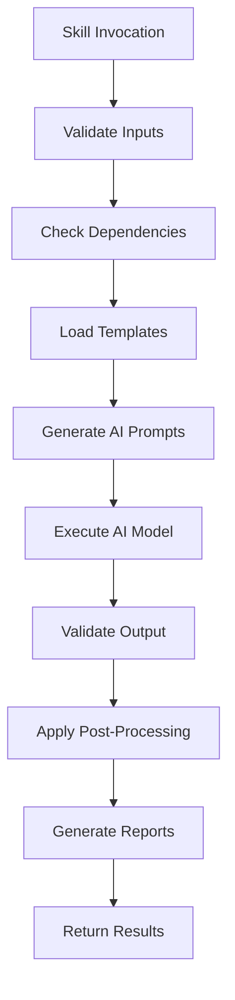

# HFT Domain Skills for Trading Platform

## 🎯 Overview

This document describes the **HFT (High-Frequency Trading) domain-specific AI skills** available for the Trading Platform project. These skills encapsulate expertise in HFT technologies, patterns, and best practices to accelerate development while maintaining the authenticity and performance characteristics required for trading systems.

## 📋 Table of Contents

1. [HFT Skills Architecture](#hft-skills-architecture)
2. [Available HFT Skills](#available-hft-skills)
3. [Skill Usage Patterns](#skill-usage-patterns)
4. [Skill Configuration](#skill-configuration)
5. [Custom Skill Development](#custom-skill-development)
6. [Best Practices](#best-practices)

---

## 🏗️ HFT Skills Architecture

### Skill Components

Each HFT skill consists of:

```
┌─────────────────────────────────────────────────────────────┐
│                    HFT Skill Structure                          │
├─────────────────────────────────────────────────────────────┤
│                                                                  │
│  ┌─────────────────────────────────────────────────────┐    │
│  │                    Skill Metadata                          │    │
│  │  - Name: Unique identifier (e.g., hft-aeron-setup)        │    │
│  │  - Description: What the skill does                       │    │
│  │  - Version: Skill version                                  │    │
│  │  - Author: Skill creator                                   │    │
│  │  - Tags: Categorization (e.g., aeron, messaging, hft)     │    │
│  └─────────────────────────────────────────────────────┘    │
│                                                                  │
│  ┌─────────────────────────────────────────────────────┐    │
│  │                    Skill Logic                             │    │
│  │  - Templates: Code generation templates                   │    │
│  │  - Prompts: AI prompt templates                           │    │
│  │  - Validators: Code quality checks                         │    │
│  │  - Optimizers: Performance suggestions                    │    │
│  └─────────────────────────────────────────────────────┘    │
│                                                                  │
│  ┌─────────────────────────────────────────────────────┐    │
│  │                    Skill Dependencies                       │    │
│  │  - Required skills: Prerequisite skills                   │    │
│  │  - Technology dependencies: Required tools/libraries       │    │
│  │  - Configuration: Required configuration parameters       │    │
│  └─────────────────────────────────────────────────────┘    │
│                                                                  │
│  ┌─────────────────────────────────────────────────────┐    │
│  │                    Skill Outputs                           │    │
│  │  - Generated files: Output file patterns                   │    │
│  │  - Side effects: Additional actions performed              │    │
│  │  - Reports: Generated documentation and analysis          │    │
│  └─────────────────────────────────────────────────────┘    │
└─────────────────────────────────────────────────────────────┘
```

### Skill Execution Flow



---

## 🎯 Available HFT Skills

### 1. Aeron Configuration Skills

#### `hft-aeron-setup` - Aeron Media Driver Setup

**Description**: Configures and sets up Aeron media driver for low-latency UDP multicast messaging.

**Use Cases**:
- Setting up Aeron media driver container
- Configuring UDP multicast channels
- Tuning Aeron parameters for performance
- Troubleshooting Aeron connectivity

**Capabilities**:
- Generate Aeron configuration files
- Create Docker configurations for Aeron
- Configure UDP multicast addresses and ports
- Set up buffer sizes and flow control parameters
- Generate Aeron wrapper classes

**Parameters**:
| Parameter | Type | Required | Default | Description |
|-----------|------|----------|---------|-------------|
| `media-driver-uri` | string | No | `aeron:40123` | Media driver URI |
| `publication-channel` | string | No | `udp://239.255.255.250:40123` | Publication channel URI |
| `subscription-channel` | string | No | `udp://239.255.255.250:40123` | Subscription channel URI |
| `buffer-size` | int | No | `16777216` | Buffer size in bytes |
| `socket-buffer-size` | int | No | `1048576` | Socket buffer size |
| `flow-control` | bool | No | `true` | Enable flow control |
| `term-buffer-length` | int | No | `65536` | Term buffer length |

**Example Usage**:
```bash
# Basic Aeron setup
ai-develop --skill hft-aeron-setup --output src/Common/TradingPlatform.Common/Aeron/

# Custom configuration
ai-develop --skill hft-aeron-setup \
  --media-driver-uri aeron:40123 \
  --publication-channel udp://239.255.255.250:40123 \
  --subscription-channel udp://239.255.255.250:40123 \
  --buffer-size 33554432 \
  --output src/Common/TradingPlatform.Common/Aeron/
```

**Generated Files**:
- `AeronConfig.cs` - Configuration class
- `AeronPublisher.cs` - Message publisher
- `AeronSubscriber.cs` - Message subscriber
- `AeronChannelManager.cs` - Channel management
- `aeron-config.json` - Configuration file

**Dependencies**:
- Aeron.NET NuGet package
- .NET 8+ runtime

---

#### `hft-aeron-optimize` - Aeron Performance Optimization

**Description**: Analyzes and optimizes Aeron configuration for maximum performance.

**Use Cases**:
- Tuning Aeron for specific throughput requirements
- Optimizing for low-latency vs high-throughput
- Troubleshooting performance issues
- Benchmarking different configurations

**Capabilities**:
- Analyze current Aeron configuration
- Suggest optimal buffer sizes
- Recommend flow control parameters
- Generate performance benchmarks
- Create configuration profiles for different scenarios

**Parameters**:
| Parameter | Type | Required | Default | Description |
|-----------|------|----------|---------|-------------|
| `target-throughput` | int | No | `10000` | Target messages per second |
| `target-latency` | int | No | `50` | Target latency in microseconds |
| `message-size` | int | No | `128` | Average message size in bytes |
| `channel-count` | int | No | `1` | Number of channels |
| `environment` | string | No | `local` | Environment (local, aws, production) |

**Example Usage**:
```bash
# Optimize for high throughput
ai-optimize --skill hft-aeron-optimize \
  --target-throughput 20000 \
  --target-latency 100 \
  --message-size 256 \
  --channel-count 4

# Generate configuration profiles
ai-optimize --skill hft-aeron-optimize \
  --scenarios "low-latency,high-throughput,balanced" \
  --output configs/aeron/
```

**Generated Files**:
- `aeron-optimized-config.json` - Optimized configuration
- `aeron-benchmark-results.md` - Performance benchmark results
- `aeron-profiles/` - Configuration profiles for different scenarios

---

### 2. SBE Schema Skills

#### `hft-sbe-design` - SBE Schema Design

**Description**: Designs and generates SBE (Simple Binary Encoding) schemas for trading messages.

**Use Cases**:
- Creating new message schemas
- Extending existing schemas
- Generating C# classes from schemas
- Validating schema designs

**Capabilities**:
- Design message schemas based on requirements
- Generate SBE XML schema files
- Create C# classes from SBE schemas
- Validate schema compatibility
- Generate documentation for schemas

**Parameters**:
| Parameter | Type | Required | Default | Description |
|-----------|------|----------|---------|-------------|
| `schema-type` | string | No | `market-data` | Schema type (market-data, orders, execution) |
| `message-types` | string[] | No | `[]` | Message types to include |
| `namespace` | string | No | `TradingPlatform.Sbe` | C# namespace for generated classes |
| `output-dir` | string | No | `schemas/sbe/` | Output directory for schema files |
| `code-output` | string | No | `src/Common/TradingPlatform.Common/Sbe/Generated/` | Output directory for C# classes |

**Example Usage**:
```bash
# Create market data schema
ai-develop --skill hft-sbe-design \
  --schema-type market-data \
  --message-types "MarketDataUpdate,OrderBookUpdate,Trade" \
  --namespace TradingPlatform.Sbe.MarketData \
  --output-dir schemas/sbe/market_data.xml

# Generate C# classes from schema
ai-generate --sbe schemas/sbe/market_data.xml \
  --language csharp \
  --namespace TradingPlatform.Sbe.MarketData \
  --output src/Common/TradingPlatform.Common/Sbe/Generated/
```

**Generated Files**:
- `market_data.xml` - SBE schema file
- `MarketDataUpdate.cs` - Generated C# class
- `OrderBookUpdate.cs` - Generated C# class
- `Trade.cs` - Generated C# class
- `schema-documentation.md` - Schema documentation

**Dependencies**:
- SBE code generator (Java)
- .NET 8+ runtime

---

#### `hft-sbe-validate` - SBE Schema Validation

**Description**: Validates SBE schemas and generated code for correctness and compatibility.

**Use Cases**:
- Validating schema designs
- Checking schema compatibility
- Verifying generated code
- Detecting breaking changes

**Capabilities**:
- Validate schema syntax and structure
- Check for compatibility issues
- Verify generated code compiles
- Detect breaking changes between versions
- Generate compatibility reports

**Parameters**:
| Parameter | Type | Required | Default | Description |
|-----------|------|----------|---------|-------------|
| `schema-file` | string | Yes | - | Path to schema file |
| `previous-schema` | string | No | - | Path to previous schema for comparison |
| `code-dir` | string | No | - | Directory containing generated code |
| `strict` | bool | No | `false` | Enable strict validation |

**Example Usage**:
```bash
# Validate a schema
ai-validate --skill hft-sbe-validate --schema-file schemas/sbe/market_data.xml

# Check for breaking changes
ai-validate --skill hft-sbe-validate \
  --schema-file schemas/sbe/market_data_v2.xml \
  --previous-schema schemas/sbe/market_data.xml \
  --strict true
```

**Generated Files**:
- `validation-report.md` - Validation results and issues
- `compatibility-report.md` - Compatibility analysis

---

### 3. Market Data Skills

#### `hft-market-data` - Market Data Pipeline Implementation

**Description**: Implements market data feed handlers and processing components.

**Use Cases**:
- Creating feed handlers for exchanges
- Implementing synthetic data generators
- Building market data processing pipelines
- Setting up data normalization and caching

**Capabilities**:
- Generate feed handler base classes
- Implement synthetic data generators
- Create market data processors
- Set up data normalization
- Implement caching strategies

**Parameters**:
| Parameter | Type | Required | Default | Description |
|-----------|------|----------|---------|-------------|
| `component` | string | Yes | - | Component to generate (feed-handler, synthetic-feed, processor, cache) |
| `exchange` | string | No | - | Exchange for feed handler (binance, kraken, etc.) |
| `symbols` | string[] | No | `[]` | Symbols to include |
| `rate` | int | No | `1000` | Message rate for synthetic feed |
| `data-types` | string[] | No | `["ticker", "orderbook", "trade"]` | Data types to handle |

**Example Usage**:
```bash
# Create synthetic feed
ai-develop --skill hft-market-data --component synthetic-feed \
  --symbols "BTCUSDT,ETHUSDT,SOLUSDT" \
  --rate 5000 \
  --data-types "ticker,orderbook,trade" \
  --output src/FeedHandlers/Synthetic/

# Create Binance feed handler
ai-develop --skill hft-market-data --component feed-handler \
  --exchange binance \
  --data-types "ticker,orderbook,trade" \
  --output src/FeedHandlers/Crypto/Binance/
```

**Generated Files**:
- `SyntheticFeed.cs` - Synthetic data generator
- `FeedHandlerBase.cs` - Base feed handler class
- `BinanceFeedHandler.cs` - Binance-specific feed handler
- `MarketDataProcessor.cs` - Data processing component
- `MarketDataCache.cs` - Data caching component

**Dependencies**:
- Aeron.NET for messaging
- SBE generated classes
- Prometheus.NET for metrics

---

#### `hft-market-data-normalize` - Data Normalization

**Description**: Implements data normalization for different exchange formats.

**Use Cases**:
- Normalizing data from different exchanges
- Converting between data formats
- Validating and cleaning market data
- Handling missing or inconsistent data

**Capabilities**:
- Generate normalization mappings
- Create data validation rules
- Implement format conversion
- Handle edge cases and errors

**Parameters**:
| Parameter | Type | Required | Default | Description |
|-----------|------|----------|---------|-------------|
| `source-format` | string | Yes | - | Source data format |
| `target-format` | string | Yes | - | Target data format |
| `exchanges` | string[] | No | `[]` | Exchanges to support |
| `validation-rules` | string | No | `strict` | Validation strictness (strict, lenient, none) |

**Example Usage**:
```bash
# Create normalization for Binance to internal format
ai-develop --skill hft-market-data-normalize \
  --source-format binance \
  --target-format internal \
  --exchanges binance,kraken \
  --validation-rules strict \
  --output src/FeedHandlers/Normalization/
```

**Generated Files**:
- `BinanceNormalizer.cs` - Binance data normalizer
- `KrakenNormalizer.cs` - Kraken data normalizer
- `MarketDataValidator.cs` - Data validation component
- `normalization-rules.json` - Normalization configuration

---

### 4. Strategy Framework Skills

#### `hft-strategy-framework` - Trading Strategy Framework

**Description**: Implements the trading strategy framework and example strategies.

**Use Cases**:
- Creating strategy interfaces and base classes
- Implementing strategy lifecycle management
- Building example trading strategies
- Setting up strategy configuration

**Capabilities**:
- Generate strategy interfaces
- Create strategy base classes
- Implement strategy managers
- Generate example strategies
- Set up configuration systems

**Parameters**:
| Parameter | Type | Required | Default | Description |
|-----------|------|----------|---------|-------------|
| `task` | string | Yes | - | Task to perform (interface, base-class, manager, strategy) |
| `strategy` | string | No | - | Strategy type (market-making, stat-arb, etc.) |
| `strategy-type` | string | No | - | Strategy implementation type |
| `parameters` | string | No | - | Strategy parameters as key=value pairs |

**Example Usage**:
```bash
# Create strategy interface
ai-develop --skill hft-strategy-framework --task interface \
  --output src/Algorithms/Core/ITradingAlgorithm.cs

# Create strategy base class
ai-develop --skill hft-strategy-framework --task base-class \
  --output src/Algorithms/Core/StrategyBase.cs

# Implement market making strategy
ai-develop --skill hft-strategy-framework --task strategy \
  --strategy market-making \
  --strategy-type "midpoint-based" \
  --parameters "spread=0.001,order_size=0.01,refresh_interval=100" \
  --output src/Algorithms/MarketMaking/
```

**Generated Files**:
- `ITradingAlgorithm.cs` - Strategy interface
- `StrategyBase.cs` - Base strategy class
- `StrategyManager.cs` - Strategy lifecycle manager
- `MarketMakingStrategy.cs` - Market making implementation
- `StatArbStrategy.cs` - Statistical arbitrage implementation

**Dependencies**:
- Aeron.NET for market data subscription
- SBE generated classes
- Prometheus.NET for metrics

---

#### `hft-strategy-optimize` - Strategy Optimization

**Description**: Optimizes trading strategies for performance and profitability.

**Use Cases**:
- Parameter optimization
- Performance tuning
- Risk parameter adjustment
- Backtesting and validation

**Capabilities**:
- Generate parameter optimization code
- Create backtesting frameworks
- Analyze strategy performance
- Suggest parameter improvements
- Validate optimization results

**Parameters**:
| Parameter | Type | Required | Default | Description |
|-----------|------|----------|---------|-------------|
| `strategy` | string | Yes | - | Strategy to optimize |
| `metrics` | string[] | No | `["sharpe_ratio", "max_drawdown", "win_rate"]` | Optimization metrics |
| `parameters` | string[] | No | `[]` | Parameters to optimize |
| `constraints` | string | No | - | Optimization constraints |
| `backtest-period` | string | No | `30d` | Backtesting period |

**Example Usage**:
```bash
# Optimize market making strategy
ai-optimize --skill hft-strategy-optimize \
  --strategy market-making \
  --metrics "sharpe_ratio,max_drawdown,profit_factor" \
  --parameters "spread,order_size,refresh_interval" \
  --constraints "max_position=10, max_exposure=10000" \
  --backtest-period "7d"

# Generate backtesting framework
ai-develop --skill hft-strategy-framework --task backtesting \
  --output src/Algorithms/Backtesting/
```

**Generated Files**:
- `StrategyOptimizer.cs` - Optimization component
- `BacktestingEngine.cs` - Backtesting framework
- `ParameterOptimizer.cs` - Parameter optimization
- `optimization-results.md` - Optimization analysis

---

### 5. Execution Skills

#### `hft-execution` - Order Execution Implementation

**Description**: Implements order execution services and exchange connectors.

**Use Cases**:
- Creating execution simulators
- Implementing exchange connectors
- Building order management systems
- Setting up execution routing

**Capabilities**:
- Generate execution simulator
- Create exchange connector base classes
- Implement order management
- Set up order routing logic
- Handle execution events

**Parameters**:
| Parameter | Type | Required | Default | Description |
|-----------|------|----------|---------|-------------|
| `component` | string | Yes | - | Component to generate (simulator, connector, manager, router) |
| `exchange` | string | No | - | Exchange for connector |
| `fill-probability` | double | No | `0.8` | Fill probability for simulator |
| `avg-latency` | int | No | `50` | Average execution latency in ms |
| `error-rate` | double | No | `0.01` | Error rate for simulator |

**Example Usage**:
```bash
# Create execution simulator
ai-develop --skill hft-execution --component simulator \
  --fill-probability 0.85 \
  --avg-latency 30 \
  --error-rate 0.005 \
  --output src/Execution/ExecutionSimulator.cs

# Create Binance connector
ai-develop --skill hft-execution --component connector \
  --exchange binance \
  --api-type rest \
  --output src/Execution/Connectors/Binance/
```

**Generated Files**:
- `ExecutionSimulator.cs` - Order execution simulator
- `ExchangeConnectorBase.cs` - Base connector class
- `BinanceConnector.cs` - Binance-specific connector
- `OrderManager.cs` - Order lifecycle manager
- `OrderRouter.cs` - Intelligent order routing

**Dependencies**:
- Aeron.NET for order command publishing
- SBE generated classes for order messages
- Prometheus.NET for metrics

---

#### `hft-execution-validate` - Execution Validation

**Description**: Validates order execution logic and ensures correctness.

**Use Cases**:
- Validating order routing logic
- Testing execution scenarios
- Verifying order state management
- Checking for race conditions

**Capabilities**:
- Generate execution test scenarios
- Validate order state transitions
- Check for thread safety issues
- Verify error handling

**Parameters**:
| Parameter | Type | Required | Default | Description |
|-----------|------|----------|---------|-------------|
| `scenarios` | string[] | No | `["normal", "high_volume", "error"]` | Test scenarios |
| `concurrency-level` | int | No | `10` | Concurrency level for testing |
| `validation-type` | string | No | `full` | Validation type (full, quick, custom) |

**Example Usage**:
```bash
# Validate execution logic
ai-validate --skill hft-execution-validate \
  --scenarios "normal,high_volume,error,race_condition" \
  --concurrency-level 50 \
  --validation-type full
```

**Generated Files**:
- `execution-validation-report.md` - Validation results
- `ExecutionTestScenarios.cs` - Test scenario implementations

---

### 6. Risk Management Skills

#### `hft-risk-management` - Risk Service Implementation

**Description**: Implements risk management services and controls.

**Use Cases**:
- Creating risk check implementations
- Building risk monitoring services
- Setting up risk limits and thresholds
- Implementing risk actions

**Capabilities**:
- Generate risk check base classes
- Create specific risk check implementations
- Implement risk monitoring
- Set up alerting and actions

**Parameters**:
| Parameter | Type | Required | Default | Description |
|-----------|------|----------|---------|-------------|
| `component` | string | Yes | - | Component to generate (service, check, monitor, action) |
| `checks` | string[] | No | `[]` | Risk checks to implement |
| `limits` | string | No | - | Risk limits configuration |
| `actions` | string[] | No | `["cancel_orders", "disable_strategy"]` | Risk actions to implement |

**Example Usage**:
```bash
# Create risk service
ai-develop --skill hft-risk-management --component service \
  --checks "position_limit,exposure_limit,loss_limit,fat_finger" \
  --actions "cancel_orders,disable_strategy,alert" \
  --output src/Risk/

# Create position limit check
ai-develop --skill hft-risk-management --component check \
  --check position-limit \
  --limits "max_position=100,warning_threshold=0.8" \
  --output src/Risk/Checks/PositionLimitCheck.cs
```

**Generated Files**:
- `RiskService.cs` - Main risk service
- `RiskCheckBase.cs` - Base risk check class
- `PositionLimitCheck.cs` - Position limit implementation
- `ExposureLimitCheck.cs` - Exposure limit implementation
- `RiskMonitor.cs` - Real-time risk monitoring

**Dependencies**:
- NATS.NET for event streaming
- Prometheus.NET for metrics

---

#### `hft-risk-validate` - Risk Configuration Validation

**Description**: Validates risk configurations and ensures they meet requirements.

**Use Cases**:
- Validating risk limit configurations
- Checking for conflicting limits
- Verifying risk action configurations
- Testing risk scenarios

**Capabilities**:
- Validate risk limit values
- Check for configuration conflicts
- Verify action triggers
- Generate risk test scenarios

**Parameters**:
| Parameter | Type | Required | Default | Description |
|-----------|------|----------|---------|-------------|
| `config-file` | string | Yes | - | Path to risk configuration file |
| `scenarios` | string[] | No | `["normal", "stress", "edge"]` | Test scenarios |
| `validation-type` | string | No | `full` | Validation type |

**Example Usage**:
```bash
# Validate risk configuration
ai-validate --skill hft-risk-validate \
  --config-file configs/risk-config.json \
  --scenarios "normal,stress,edge" \
  --validation-type full
```

**Generated Files**:
- `risk-validation-report.md` - Validation results
- `RiskTestScenarios.cs` - Risk test implementations

---

### 7. Performance Skills

#### `hft-performance` - Performance Optimization

**Description**: Provides performance optimization suggestions and implementations for HFT components.

**Use Cases**:
- Identifying performance bottlenecks
- Suggesting optimization strategies
- Implementing performance improvements
- Benchmarking and profiling

**Capabilities**:
- Analyze code for performance issues
- Suggest optimization strategies
- Generate optimized code implementations
- Create benchmarking tests
- Profile memory usage and GC behavior

**Parameters**:
| Parameter | Type | Required | Default | Description |
|-----------|------|----------|---------|-------------|
| `component` | string | Yes | - | Component to optimize |
| `metric` | string | No | `latency` | Metric to optimize (latency, throughput, memory, gc) |
| `target` | string | No | - | Target value for metric |
| `constraints` | string[] | No | `[]` | Optimization constraints |
| `analysis-depth` | string | No | `medium` | Analysis depth (quick, medium, deep) |

**Example Usage**:
```bash
# Analyze Aeron publisher performance
ai-optimize --skill hft-performance \
  --component AeronPublisher \
  --metric latency \
  --target "<50μs" \
  --constraints "memory<1GB,gc<1%" \
  --analysis-depth deep

# Suggest memory optimizations
ai-optimize --skill hft-performance \
  --component StrategyManager \
  --metric memory \
  --target "<512MB" \
  --suggestions "object_pooling,struct_usage,array_pool"
```

**Generated Files**:
- `performance-analysis-report.md` - Performance analysis
- `optimization-suggestions.md` - Optimization recommendations
- `BenchmarkTests.cs` - Performance benchmark tests

---

#### `hft-performance-benchmark` - Performance Benchmarking

**Description**: Creates comprehensive performance benchmarks for trading platform components.

**Use Cases**:
- Measuring component latency
- Testing throughput capabilities
- Profiling memory usage
- Comparing different implementations

**Capabilities**:
- Generate BenchmarkDotNet tests
- Create load testing scenarios
- Measure latency distributions
- Profile memory allocations
- Compare before/after optimizations

**Parameters**:
| Parameter | Type | Required | Default | Description |
|-----------|------|----------|---------|-------------|
| `component` | string | Yes | - | Component to benchmark |
| `scenarios` | string[] | No | `["1k", "5k", "10k", "20k"]` | Throughput scenarios (msgs/sec) |
| `metrics` | string[] | No | `["latency", "throughput", "memory", "gc"]` | Metrics to measure |
| `duration` | string | No | `1m` | Benchmark duration |
| `warmup` | string | No | `30s` | Warmup duration |

**Example Usage**:
```bash
# Benchmark Aeron publisher
ai-test --generate --type performance \
  --skill hft-performance-benchmark \
  --component AeronPublisher \
  --scenarios "1k,5k,10k,20k" \
  --metrics "latency,throughput,memory,gc" \
  --duration "2m" \
  --warmup "30s" \
  --output tests/Performance/AeronPublisherBenchmarks.cs
```

**Generated Files**:
- `AeronPublisherBenchmarks.cs` - Benchmark implementations
- `benchmark-results.md` - Benchmark results and analysis
- `performance-comparison.md` - Before/after comparison

---

## 🔧 Skill Usage Patterns

### 1. Single Skill Usage

Use a single skill for a specific task:

```bash
# Generate SBE schema
ai-develop --skill hft-sbe-design --task "Create market data schema"

# Optimize Aeron configuration
ai-optimize --skill hft-aeron-optimize --target-throughput 20000
```

### 2. Multi-Skill Workflow

Combine multiple skills for complex tasks:

```bash
# Create complete feed handler
# 1. Design SBE schema
ai-develop --skill hft-sbe-design --schema-type market-data

# 2. Generate C# classes
ai-generate --sbe schemas/sbe/market_data.xml --language csharp

# 3. Create feed handler
ai-develop --skill hft-market-data --component feed-handler --exchange binance

# 4. Generate tests
ai-test --generate --component BinanceFeedHandler --type unit

# 5. Optimize performance
ai-optimize --skill hft-performance --component BinanceFeedHandler
```

### 3. Batch Processing

Process multiple components with a single command:

```bash
# Generate all feed handlers
ai-develop --skill hft-market-data --component feed-handler \
  --exchanges "binance,kraken,coinbase" \
  --batch true

# Generate tests for all components
ai-test --generate --type unit --all-components
```

### 4. Interactive Mode

Use interactive mode for complex tasks:

```bash
# Start interactive skill session
ai-develop --skill hft-strategy-framework --interactive

# AI will ask questions and guide through the process
# What type of strategy would you like to create? [market-making/stat-arb/...]
# What parameters should it have?
# What risk limits should be applied?
# etc.
```

---

## ⚙️ Skill Configuration

### Global Configuration

Create a `.ai-config.json` file in the project root:

```json
{
  "skills": {
    "hft-aeron-setup": {
      "default-buffer-size": 33554432,
      "default-port": 40123,
      "multicast-address": "239.255.255.250"
    },
    "hft-sbe-design": {
      "default-namespace": "TradingPlatform.Sbe",
      "output-dir": "schemas/sbe/",
      "code-output": "src/Common/TradingPlatform.Common/Sbe/Generated/"
    },
    "hft-market-data": {
      "default-rate": 1000,
      "default-symbols": ["BTCUSDT", "ETHUSDT", "SOLUSDT"],
      "data-types": ["ticker", "orderbook", "trade"]
    }
  },
  "ai": {
    "model": "gpt-4",
    "temperature": 0.7,
    "max-tokens": 4096,
    "timeout": 60
  },
  "code-generation": {
    "language": "csharp",
    "framework": "dotnet8",
    "style": "project",
    "quality": "high"
  }
}
```

### Per-Skill Configuration

Each skill can have its own configuration file:

```json
// configs/skills/hft-aeron-setup.json
{
  "default-configuration": {
    "media-driver-uri": "aeron:40123",
    "publication-channel": "udp://239.255.255.250:40123",
    "subscription-channel": "udp://239.255.255.250:40123",
    "buffer-size": 16777216,
    "socket-buffer-size": 1048576,
    "flow-control": true,
    "term-buffer-length": 65536
  },
  "profiles": {
    "low-latency": {
      "buffer-size": 8388608,
      "socket-buffer-size": 2097152,
      "flow-control": false
    },
    "high-throughput": {
      "buffer-size": 67108864,
      "socket-buffer-size": 4194304,
      "flow-control": true
    }
  }
}
```

---

## 🛠️ Custom Skill Development

### Creating a New HFT Skill

1. **Define the Skill Metadata**:

```json
// skills/my-custom-skill/skill.json
{
  "name": "hft-my-custom-skill",
  "version": "1.0.0",
  "description": "Description of what the skill does",
  "author": "Your Name",
  "tags": ["hft", "custom", "trading"],
  "parameters": {
    "param1": {
      "type": "string",
      "required": false,
      "default": "default_value",
      "description": "Description of parameter"
    }
  },
  "dependencies": ["hft-aeron-setup", "hft-sbe-design"],
  "outputs": [
    {
      "pattern": "*.cs",
      "description": "Generated C# files"
    }
  ]
}
```

2. **Create Templates**:

```csharp
// skills/my-custom-skill/templates/Template.cs
// Template for code generation
// Use placeholders for dynamic content: {{ParameterName}}

using System;
using {{Namespace}};

namespace {{Namespace}}.{{Component}}
{
    public class {{ClassName}}
    {
        private readonly ILogger<{{ClassName}}> _logger;
        
        public {{ClassName}}(ILogger<{{ClassName}}> logger)
        {
            _logger = logger;
        }
        
        // Implementation will be generated based on requirements
        {{#Methods}}
        public {{ReturnType}} {{MethodName}}({{Parameters}})
        {
            {{MethodBody}}
        }
        {{/Methods}}
    }
}
```

3. **Create AI Prompts**:

```yaml
# skills/my-custom-skill/prompts/main.yaml
prompt: |
  You are an expert in high-frequency trading systems. 
  Create a {{ComponentType}} for a trading platform with the following requirements:
  
  Requirements:
  {{#Requirements}}
  - {{.}}
  {{/Requirements}}
  
  Technical Constraints:
  {{#Constraints}}
  - {{.}}
  {{/Constraints}}
  
  Best Practices:
  - Use dependency injection for all dependencies
  - Implement proper error handling and logging
  - Follow SOLID principles
  - Optimize for low-latency performance
  - Make code testable and maintainable
  
  Output Format:
  - Use C# 8.0+ features
  - Follow the project's coding standards
  - Include XML documentation comments
  - Generate comprehensive unit tests

temperature: 0.7
max_tokens: 4096
top_p: 0.9
```

4. **Create Validators**:

```csharp
// skills/my-custom-skill/validators/CodeValidator.cs
using System;
using System.Text.RegularExpressions;

public class CodeValidator
{
    public ValidationResult Validate(string code, string language)
    {
        var result = new ValidationResult();
        
        if (language == "csharp")
        {
            // Check for proper using directives
            if (!code.Contains("using System;"))
                result.AddError("Missing System using directive");
            
            // Check for proper namespace
            if (!Regex.IsMatch(code, @